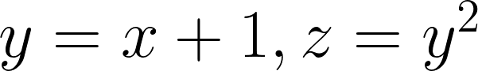

신경망이 학습을 하는 원리는 기본적으로 '모델 f(x)가 입력 x에 대해 적절한 예측값인 y을 출력하게 하는 모델 f(x)의 구성품인 매개변수(가중치)을 정하는 작업'이다. 데이터를 입력하고 나온 결과인 예측값과 정답값을 비교하여 그 차이인 Loss값을 구하고 그 값을 최소화하는 방향으로 학습을 하게 된다. 즉, Loss값을 최소화하기 위해 loss값의 함수인 '손실함수'를 사용한다.
신경망 학습에서는 최적의 매개변수(가중치)를 탐색할 때 손실 함수의 값을 가능한 한 작게 하는 매개변수(가중치)를 찾는다. 즉, Loss에 대한 각각의 매개변수의 미분을 계산하고, 그 미분 값을 서서히 갱신하여 최적의 매개변수를 찾는 과정으로 학습을 한다.

<br>

**그렇다면 왜 '정확도'라는 지표를 두고 '손실 함수'라는 우회적인 방법을 택하는 것일까요?**

<br>

만약 '정확도'를 지표로 사용을 한다면 위에서 언급한 '미분'값이 대부분의 장소에서 0값이 되기 때문이다. 예를 들어 100장의 사진을 예측했는데 32장만 올바르게 예측했다면 이 모델은 32%의 정확도를 띈다. 하지만 정확도를 향상시키기 위해 가중치 매개변수의 값을 조금 바꾼다고 해도 일정하게 유지하는 경향이 있고, 값이 바뀐다고 하더라도 35.12355...% 와 같은 연속적인 숫자보다도 37%, 38% 등의 불연속적인 값으로 바뀐다.
따라서 효율적인 학습을 위해 Loss값을 이용한 '손실 함수'를 지표로 이용하게 된다.


# AutoGrad
<hr>

Pytorch에서는 이러한 '미분'값을 쉽고 빠르게 구할 수 있도록 하는 자동미분 기능을 제공한다.
- 앞에서 배웠던 torch.Tensor() 클래스로 Tensor을 생성
- 클래스 안에 .requires_grad 속성을 True로 설정하면 자동미분 기능을 켤 수 있다.
- 자동미분이 적용되는 Tensor의 모든 연산을 추적한다.
- 계산이 완료되면 .backward()를 호출하여 변화도(미분)를 자동으로 계산할 수 있다.



```python
import torch
x = torch.ones(2,2, requires_grad=True) # 2x2 행렬(값이 모두 1)
>>> print(x)
# tensor([[1., 1.],
#         [1., 1.]], requires_grad=True)

```
