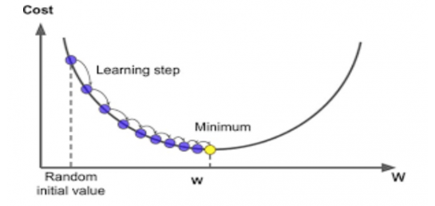

앞 포스터에서 선형회귀모델과 두 좌표를 이용한 방식과 정규방정식을 이용하여 손실함수J($\theta$)를 최소화하는 $\theta$값을 구하는 방법에 대해 알아보았다. 물론 Pytorch를 이용하긴 했지만, 앞 두 가지 방법은 numpy나 scipy 등 다른 라이브러리로도 충분히 구할 수 있었다. 따라서 이번 포스터는 Pytorch를 적극 활용하여 $\theta$값을 찾을 수 있는 경사하강법에 대해 알아보자.

### 경사하강법(Gradient-Descent)
 

사실 위에서 했던 방법들은 굳이 Pytorch를 사용하지 않아도 numpy, scipy 등을 이용해서 충분히 구현할 수 있다. 이번에는 Pytorch만의 기능을 이용해서 구해볼 예정인데, '경사하강법'을 이용해 손실함수를 최소로 하는 $\theta$를 구해보도록 하자.
 

**경사하강법**은 최적화 알고리즘으로 손실함수를 최소화하기 위해 반복해서 파라미터(계수)들을 조정해가는 것을 말한다. 처음에는 무작위로 초기화된 $\theta$로 시작해 손실함수(여기서는 MSE를 사용)가 감소되는 방향으로 진행하여 모델이 최솟값에 도달할 수 있도록 $\theta$를 갱신하는 알고리즘이다. 그렇다면 왜 이름에 '경사'가 들어갔을까? 바로 **미분**을 이용하기 때문이다.

 

**미분**은 '기울기'를 뜻한다. 손실함수를 정하고 손실함수가 최소가 되도록 하는 매개변수를 찾는 것이 학습의 목표인데, 손실함수의 미분값이 0 되는 부분을 찾으면 그 때의 매개변수가 손실함수를 최소로 하는 매개변수이다. 하지만 신경망은 식이 매우 복잡하고 미분계수를 계산하기 어려워서 손실함수의 미분값이 0이 되는 부분을 찾기에는 쉽지 않다. 그래서 '기울기'를 이용해서 경사가 낮은 방향으로 매개변수를 변화시켜 최소인 지점을 찾는 것이다.
 
경사하강법을 설명할 수 있는 아주 좋은 예시가 있다.
> 앞이 보이지 않는 어두운 밤에 산을 내려온다고 가정하자. 등산객은 사방으로 발을 더듬으면서 높이가 낮아지는 방향으로 나아가게 된다.

 

