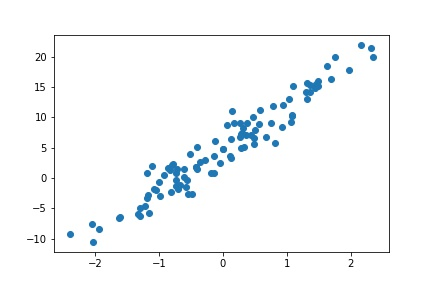
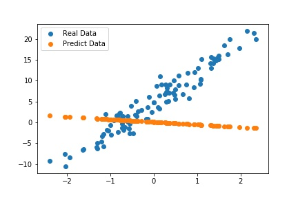

이번 포스트에서는 Pytorch를 이용하여 신경망을 정의하는 방법과 구조에 대해 알아보고 텐서(Tensor)가 어떻게 계산이 되는지, 또한 실제로 신경망이 어떻게 학습이 되는지에 대해 알아보자.

<br>

# 신경망 정의
<hr>

아래의 코드는 Pytorch를 이용하여 신경망 모델을 정의할 때 사용하는 프로토타입이다.

```python
import torch
import torch.nn as nn

class Model(nn.Module): # Pytorch 모듈 중 nn 상속받기(nn에 있는 기능 사용 가능)
    def __init__(self, input_size, output_size): # 초기화 함수
    
    def forward(self, x):
        
        return out
```

Pytorch에서는 모델을 정의할 때 Class를 이용하고, nn.Module을 상속받아 여러가지 유용한 유틸을 활용한다.
- ```__init__()``` : 모델을 구성하는 여러 파라미터들을 정의하는 부분
- ```forward()``` : 입력값에 대해 계산이 이루어지는 부분
- ```nn.Module``` : Pytorch에서 제공하는 신경망을 이루는데 유용한 유틸 모음

<br>

보통 신경망은 연산이 가능한 여러 층들이 쌓여서 만들어진 모델이다. 따라서 ```__init__```에서 신경망을 구성할 때 사용하는 각 층을 정의하고, 입력값과 출력값의 크기 등을 설정한다. 임의의 데이터를 생성하고 모델을 정의한 후 데이터에 맞는 선형회귀선을 찾아보자. 이때 학습하는 과정도 같이 알아보도록 하자.
<br>

필자가 정의하고 학습할 선형회귀모델은 다음과 같다.

<br>

$$
y = \theta_0 + \theta_1x
$$

<br>

### 데이터 생성

<br>

단순선형회귀를 이용하기 때문에 독립변수$x$와 종속변수$y$가 각각 1개이며 예측해야 하는 값은 2개이다. 임의의 데이터를 생성하면 다음과 같다.

<br>

```python
x = torch.randn((100,1))
y = 7*x + 5 + torch.normal(0,2,(100,1)) # 노이즈 첨가

>>> torch.cat((x,y),1)[:10]
# tensor([[ 1.5048, 13.6858],
#         [-0.1398,  5.4163],
#         [ 2.3057, 22.8123],
#         [ 0.5640,  7.9670],
#         [-0.8410, -2.1296],
#         [-0.1577,  1.7757],
#         [ 2.9104, 24.8814],
#         [-0.4915, -1.7805],
#         [ 1.6042, 17.8675],
#         [-1.1555, -6.8106]])
```

<br>

임의의 데이터를 생성할 때 이미 $\theta$값을 설정하였다. 하지만 선형회귀모델을 정의할 때 $\theta$값이 초기화되기 때문에 데이터에 맞는 $\theta$를 찾을 필요가 있다. 따라서 학습이 끝난 후에 예측된 $\theta$와 우리가 정했던 $\theta$가 일치하는 확인하면 될 것 같다. 다음과 같이 회귀선을 예측해야한다.



<br>

### 모델 생성

<br>

데이터를 생성했으니 이제 데이터를 학습할 모델을 정의해보자. Pytorch에서는 선형회귀모델을 정의할 수 있는 함수를 제공하는데, ```nn.Linear()```을 이용하여 간단하게 모델을 생성할 수 있다.

<br>

```python
import torch
import torch.nn as nn

class MyLinear(nn.Module): # Pytorch 모듈 중 nn 상속받기(nn에 있는 기능 사용 가능)
    def __init__(self, input_size, output_size): # 초기화 함수
        super(MyLinear, self).__init__()
        self.linear = nn.Linear(input_size, output_size, bias=True) # nn모듈에 있는 Linear함수 사용하기
    
    def forward(self, x):
        y = self.linear(x) # x 연산하기
        
        return y

model = MyLinear(1,1)
```

<br>

위 코드에 있는 정보들을 정리하면 다음과 같다.
- ```nn.Module``` : Pytorch에서 모델을 정의할 때 여러 유틸을 제공
- ```super()``` : 아버지 클래스인 ```nn.Module```의 ```__init__()```함수를 호출한다는 뜻(덮어쓰기)
- ```nn.Linear()``` : 입,출력 크기에 맞는 선형회귀모델을 만들어주는 함수
- ```bias=True``` : 편향값을 설정(여기서는 $\theta_0$값을 의미)

<br>

모델을 정의했으니 잘 동작하는지 확인해보자. 추가로 기존 데이터와 생성된 모델로 예측한 데이터가 얼마나 이질적인지도 확인해보자!

<br>

```python
with torch.no_grad(): # Autograd 끄기
    model = MyLinear(1,1)
    out = model(x)

>>>print(out[:10])
# tensor([[-0.3884],
#         [ 0.1694],
#         [-0.0855],
#         [ 0.8922],
#         [-0.5119],
#         [-0.1453],
#         [ 0.6156],
#         [-0.0888],
#         [-0.2215],
#         [-0.2758]])
```

<br>

위 코드에서 진행한 계산은 단순히 확인용이기 때문에 ```torch.no_grad()```을 통해 자동미분을 off한 상태로 실행을 했다. 실제와 예측 데이터를 비교하면 다음과 같다.

<br>



<br>

현재 초기화 된 $\theta$값을 확인하면 다음과 같다.

<br>

```python
for p in model.parameters():
>>> print(p)
# Parameter containing:
# tensor([[-0.6244]], requires_grad=True)
# Parameter containing:
# tensor([0.0785], requires_grad=True)
```


<br>

$$
\hat{\theta_0} = 0.0785, \qquad \hat{\theta_1} = -0.06244
$$

<br>

```nn.Linear()```은 매개변수를 연속균동분포인 ```kaiming_uniform_```을 사용하여 초기화한다. He initialization으로도 알려진 이 랜덤함수는 **“Delving deep into rectifiers: Surpassing human-level performance on ImageNet classification” - He, K.** 이라는 논문에서 소개되었다. 기회가 되면 다뤄보도록 하겠다.

<br>

데이터를 생성할 당시에 설정한 $\theta$는 각각 다음과 같다.

<br>

$$
\theta_0 = 5, \qquad \theta_1 = 7
$$

<br>

지금부터는 모델이 위와 같은 $\theta$값을 가질 수 있도록 학습을 실시해보자.

# 학습(Training)
<hr>

신경망이 학습을 하기 위해서는 학습할 '모델'이 필요하고, 실제 값과 예측값의 오차를 구해줄 '오차함수'(=손실함수)와 오차를 이용해 매개변수를 갱신해줄 '최적화 알고리즘'이 필요하다. 각각을 정의하면 다음과 같다.(각각에 대해서도 나중에 다뤄볼 생각이다.)

<br>

```python
import torch.optim as optim
import torch.nn as nn
loss_func = nn.MSELoss()
optimizer = optim.SGD(model.parameters(), lr=0.001)
```

- ```MSELoss()``` : 회귀모델에서 가장 많이 사용되는 성능 측정 지표(평균제곱오차)
- ```SGD()``` : 최적화 알고리즘 중 하나로 확률적 경사하강법
- ```lr=0.001``` : 학습률을 뜻하고 최적화 알고리즘이 얼마나 매개변수를 갱신할지를 나타내는 수치

<br>

이제 모델을 학습해서 MSEloss()의 값이 최소가 되도록 하는 $\theta$값을 찾아보자.


1. 파라미터 출력

2. 학습 준비
3. 손실함수, 최적화
4. 학습 진행
5. 결과 확인
6. 실제값과 비교
7. 마무리


<br>
<br>
<br>
<br>
<br>
<br>
<br><br>
<br>
<br>
<br>
<br>
<br>
<br><br>
<br>
<br>
<br>
<br>
<br>
<br><br>
<br>
<br>
<br>
<br>
<br>
<br><br>
<br>
<br>
<br>
<br>
<br>
<br><br>
<br>
<br>
<br>
<br>
<br>
<br><br>
<br>
<br>
<br>
<br>
<br>
<br><br>
<br>
<br>
<br>
<br>
<br>
<br><br>
<br>
<br>
<br>
<br>
<br>
<br><br>
<br>
<br>
<br>
<br>
<br>
<br><br>
<br>
<br>
<br>
<br>
<br>
<br><br>
<br>
<br>
<br>
<br>
<br>
<br><br>
<br>
<br>
<br>
<br>
<br>
<br><br>
<br>
<br>
<br>
<br>
<br>
<br><br>
<br>
<br>
<br>
<br>
<br>
<br><br>
<br>
<br>
<br>
<br>
<br>
<br><br>
<br>
<br>
<br>
<br>
<br>
<br>