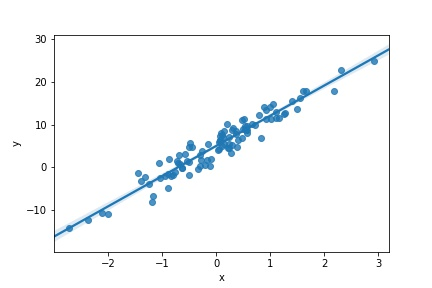

이번 포스트에서는 Pytorch를 이용하여 신경망을 정의하는 방법과 구조에 대해 알아보고 텐서(Tensor)가 어떻게 계산이 되는지, 또한 실제로 신경망이 어떻게 학습이 되는지에 대해 알아보자.

<br>

# 신경망 정의
<hr>

아래의 코드는 Pytorch를 이용하여 신경망 모델을 정의할 때 사용하는 프로토타입이다.

```python
import torch
import torch.nn as nn

class Model(nn.Module): # Pytorch 모듈 중 nn 상속받기(nn에 있는 기능 사용 가능)
    def __init__(self, input_size, output_size): # 초기화 함수
    
    def forward(self, x):
        
        return out
```

Pytorch에서는 모델을 정의할 때 Class를 이용하고, nn.Module을 상속받아 여러가지 유용한 유틸을 활용한다.
- ```__init__()``` : 모델을 구성하는 여러 파라미터들을 정의하는 부분
- ```forward()``` : 입력값에 대해 계산이 이루어지는 부분
- ```nn.Module``` : Pytorch에서 제공하는 신경망을 이루는데 유용한 유틸 모음

<br>

보통 신경망은 연산이 가능한 여러 층들이 쌓여서 만들어진 모델이다. 따라서 ```__init__```에서 신경망을 구성할 때 사용하는 각 층을 정의하고, 입력값과 출력값의 크기 등을 설정한다. 임의의 데이터를 생성하고 모델을 정의한 후 데이터에 맞는 선형회귀선을 찾아보자. 이때 학습하는 과정도 같이 알아보도록 하자.
<br>

필자가 정의하고 학습할 선형회귀모델은 다음과 같다.

<br>

$$
y = \theta_0 + \theta_1x
$$

<br>

단순선형회귀를 이용하기 때문에 독립변수$x$와 종속변수$y$가 각각 1개이며 예측해야 하는 값은 2개이다. 임의의 데이터를 생성하면 다음과 같다.

<br>

```python
x = torch.randn((100,1))
y = 7*x + 5 + torch.normal(0,2,(100,1)) # 노이즈 첨가

>>> torch.cat((x,y),1)[:10]
# tensor([[ 1.5048, 13.6858],
#         [-0.1398,  5.4163],
#         [ 2.3057, 22.8123],
#         [ 0.5640,  7.9670],
#         [-0.8410, -2.1296],
#         [-0.1577,  1.7757],
#         [ 2.9104, 24.8814],
#         [-0.4915, -1.7805],
#         [ 1.6042, 17.8675],
#         [-1.1555, -6.8106]])
```

<br>

임의의 데이터를 생성할 때 이미 $\theta$값을 설정하였다. 하지만 선형회귀모델을 정의할 때 $\theta$값이 초기화되기 때문에 데이터에 맞는 $\theta$를 찾을 필요가 있다. 따라서 학습이 끝난 후에 예측된 $\theta$와 우리가 정했던 $\theta$가 일치하는 확인하면 될 것 같다. 다음과 같이 회귀선을 예측해야한다.




<br>
<br>
<br>
<br>
<br>
<br>
<br><br>
<br>
<br>
<br>
<br>
<br>
<br><br>
<br>
<br>
<br>
<br>
<br>
<br><br>
<br>
<br>
<br>
<br>
<br>
<br><br>
<br>
<br>
<br>
<br>
<br>
<br><br>
<br>
<br>
<br>
<br>
<br>
<br><br>
<br>
<br>
<br>
<br>
<br>
<br><br>
<br>
<br>
<br>
<br>
<br>
<br><br>
<br>
<br>
<br>
<br>
<br>
<br><br>
<br>
<br>
<br>
<br>
<br>
<br><br>
<br>
<br>
<br>
<br>
<br>
<br><br>
<br>
<br>
<br>
<br>
<br>
<br><br>
<br>
<br>
<br>
<br>
<br>
<br><br>
<br>
<br>
<br>
<br>
<br>
<br><br>
<br>
<br>
<br>
<br>
<br>
<br><br>
<br>
<br>
<br>
<br>
<br>
<br><br>
<br>
<br>
<br>
<br>
<br>
<br>