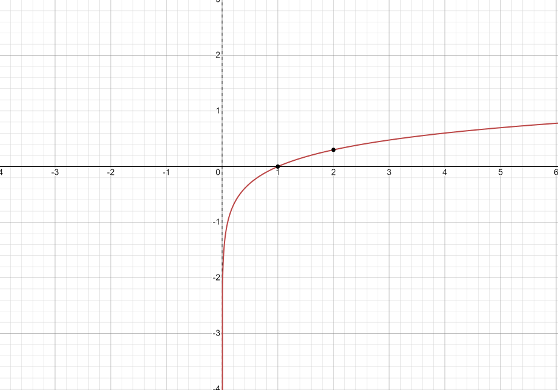

많은 사람들이 인공지능 기술에 관심을 가지게 되면서 '기계학습'이라는 개념이 많이 사용되고 있다. 굳이 따지자면 기계학습은 인공지능을 실혐시키는 '방법', '도구'일 뿐, 인공지능의 전부라고 말하기는 어렵다. 하지만 인공지능에 있어서 매우 중요한 요소는 맞다. 따라서 이번 포스터에서는 딥러닝에서 기계가 학습하는 것이 어떤 의미인지, 원리가 무엇인지 대해 알아보고 그 속에서 사용되는 손실함수(Loss Functino)이 무엇인지, 또한 무엇이 있는지에 대해 알아보자.

# 학습
<hr>

학교에서 시험을 본다고 가정을 하자. 어떤 과목이든 시험 전에 공부를 하게 되는데, 시험 범위 안에서 나올법한 내용들을 공부하고 기출문제나 족보 등을 활용하여 학습을 한다. 물론 기출문제로 풀어봤던 문제가 시험에서 그대로 나올 수도 있지만, 대부분 약간 변형해서 나오거나 완전 다른 문제가 나오기 쉽다. 이때 우리는 사전에 공부한 지식과 기출문제 등을 토대로 정답을 찾는다. 

<br>

### 기계학습

그러면 기계가 학습을 하는 건 어떤 원리일까? 사실 사람이 학습을 하는 원리와 크게 다르지 않다. 다음 식을 예로 들어보자.($x_0$, $x_1$ 데이터)

<br>

$$
y = \theta_0x_0 + \theta_1x_1
$$

<br>

데이터인 $x_0$와 $x_1$가 입력이 될 떄 정답인 $y$값이 출력이 되기 위해서는 적절한 $\theta_0$값과 $\theta_1$값이 필요하다. 기계는 사람이 입력해주는 무수한 정보(데이터, 정답)를 토대로 적절한 $\theta_0$값과 $\theta_1$를 찾아가게 되는데, 이것을 기계가 '학습'을 한다고 말한다. 마치 사람이 시험공부를 하면서 각 문제들의 정답이 어떻게 나왔는지 생각하면서 '학습'을 하듯이 기계 또한 데이터를 이용해서 정답이 나올 수 있도록 '매개변수'들을 조정한다. 인간은 단지 기계가 스스로 학습할 수 있도록 계산식의 '구조'를 설계할 뿐, 기계는 설계된 '구조' 안에서 데이터를 보고 매개변수를 조정한다.

<br>

### 성능 지표

사람이 기출문제를 풀면서 채점을 하고 틀린 문제에 대해서는 어디서 어떻게 틀렸는지 확인하는 것처럼 기계도 학습을 할 때 채점을 하고 본인이 얼마나 잘 풀었는지 확인을 하는 과정을 거친다. 즉, 본인의 성능이 얼마나 좋은지 지표를 통해 확인을 하게 된다. 기계는 지정된 '지표'를 가장 좋게 만들어주는 매개변수를 찾아가게 된다. 신경망 학습에서 이러한 '지표'를 **손실 함수(Loss Function)**라고 한다. 

<br>

# 손실 함수(Loss Function)
<hr>

특정 기계의 성능을 확인할 때 '얼마나 좋지?' 또는 '얼마나 정확하지?' 등 얼마나 잘하는지 평가를 하게 된다. 하지만 이름(손실)에서도 알 수 있듯이 신경망 학습에서는 얼마나 '못' 하는지, 얼마나 '안' 좋은지 등 우회적인 방법을 사용한다. 그 이유는 무엇일까?

<br>

**미분**에서 그 해답을 찾을 수 있다. 신경망에 있는 한 가중치 매개변수 1개를 예로 들어보자. 그 가중치 매개변수의 손실 함수에 대한 **미분**은 <u>매개변수의 값을 변화시켰을 때 손실 함수의 값이 어떻게 변하나</u>를 의미한다. 미분값의 부호에 따라 다른데, 음수일 경우는 매개변수를 양의 방향으로 변화시키고, 양수일 경우에는 음의 방향으로 변화시킨다. 만약 미분값이 0으로 수렴한다면 더이상 학습하지 않고 끝나게 된다.


<br>

그렇다면 다시 돌아와서, 만약 정확도를 지표로 이용하면 어떻게 될까?
<br>

예를 들어 100장의 훈련 데이터가 있고 신경망이 50장을 올바르게 인식을 했다면 정확도는 50%가 될 것이다. 하지만 이 상태에서 가중치 매개변수를 조금 변화시킨다고 해도 여젼히 50%에서 크게 변하지 않을 것이다. 또한 그 수치가 연속적이지 않고 50%, 60% 등 불연속적이라 대부부의 장소에서 미분값이 0이 된다.

<br>

손실함수가 무엇인지 알아보았는데, 그렇다면 손실 함수에는 어떤 것들이 있을까?

<br>

## 평균 제곱 오차(Mean squared Error)

<br>

$$
MSE = \frac{1}{n}\sum_{i=1}^{n}(\hat{y}_i - y_i)^2
$$

- `n` : 데이터의 개수
- $\hat{y_i}$ : 예측된 값
- $y_i$ : 실제 값

예측한 값과 실제 값 사이의 차이를 제곱한 값을 오차로 하는 손실함수이다. 식만 봐도 한 눈에 이해가 될 정도로 매우 간단한 함수이고 계산도 매우 쉽기 때문에 성능을 측정하는데 가장 많이 사용이 된다. 제곱을 하는 이유는 두 값의 차이가 음수가 나오면 합을 했을 때 오차가 줄어드는 문제가 발생하기 때문이다.

### 코드 실습

<br>

Pytorch에서는 MSE함수를 이용할 수 있도록 `torch.nn.MSELoss()`을 제공한다.
<br>

```python
import torch
import torch.nn as nn

print(torch.__version__)
# 1.4.0

target_y = torch.arange(1,10) # 정답
input_x = target_y + torch.rand(9) # 예측값

>> print(target_y)
>> print(input_x)
# tensor([1, 2, 3, 4, 5, 6, 7, 8, 9])
# tensor([1.7516, 2.5348, 3.4643, 4.5566, 5.3562, 6.6055, 7.2129, 8.2204, 9.3870])

MSE_loss = nn.MSELoss(reduction='mean') # default = 'mean'
>>> MSE_loss(input_x, target_y)
# tensor(0.2348)

MSE_loss = nn.MSELoss(reduction='sum')
>>> MSE_loss(input_x, target_y)
# tensor(2.1134)

MSE_loss = nn.MSELoss(reduction='none')
>>> MSE_loss(input_x, target_y)
# tensor([0.5649, 0.2861, 0.2156, 0.3098, 0.1269, 0.3666, 0.0453, 0.0486, 0.1497])
```

- `nn.MSELoss(reduction='')`
    - `none` : 계산 된 모든 오차값 출력
    - `mean` : 오차값 평균
    - `sum` : 오차값 합치기
- `input_x` : 예측된 값
- `target_y` : 실제 값

<br>

## 교차 엔트로피 오차(Cross Entropy Error)

<br>

$$
CEE = -\sum_{i=1}^{n}y_ilog_{e}\hat{y_i}
$$

- `n` : 데이터의 개수
- $\hat{y_i}$ : 예측된 값
- $y_i$ : 실제 값

교차 엔트로피 오차는 보통 분류(Classification) 문제에서 성능을 측정할 때 사용하는 손실함수이다. 분류 문제에서는 보통 정답인 것을 1, 오답인 것은 0으로 표시하는 **One-Hot Encoding** 방식을 사용하는데, 교차 엔트로피 오차는 One-Hot Encoding된 벡터의 오차를 계산하게 된다. 

<br>

### One-Hot Encoding

<br>

이해를 돕기 위해 먼저 One-Hot Encoding에 대해 알아보자.
<br>

One-Hot Encoding은 위에서 언급했듯이 0과 1로만 이루어진 **벡터**를 말한다. 이 벡터는 신경망에서 주로 분류(Classification) 문제를 다룰 때 사용한다. input으로 이미지 데이터가 들어오고 3종류의 동물(강아지, 고양이, 새)을 구별하는 문제가 있다고 가정하자. 만약 강아지 이미지가 input 데이터로 들어올 때, 정답 레이블은 (1, 0, 0)이 된다.

<br>

$$
\text{(강아지, 고양이, 새)}\quad =\quad (1, 0, 0)
$$

<br>

다시 교차 엔트로피 오차로 돌아와서, 신경망 모델에 의해 input된 이미지 데이터는 정답 레이블과 같은 형태인 (0.80, 0.1, 0.1) 벡터로 출력이 될 것이다. 그러면 정답 레이블(1, 0, 0)과 비교하여 오차를 구하게 된다. 이때 사용되는 것이 교차 엔트로피 오차이다. 

<br>

식을 잘 보면 $y_nlog_e\hat{y_n}$에서 $y_n$가 정답 레이블이다. 정답인 class(강아지, 고양이, 새 중 하나)를 제외하고는 모두 0이 되기 때문에 정답 class에 대한 예측값만 남아있게 되고, 그 값에 대한 오차만 계산을 한다. 다음 그림은 $log_e$의 그래프이다.




그 예측값이 1에 가까워질수록 오차값은 0으로 수렴하게 된다. 따라서 이 오차값을 이용해서 신경망이 학습을 하게 된다.


<br>
<br>
<br>
<br>
<br>
<br>
<br>
<br>
<br>
<br>
<br>
<br>
<br>
<br>
<br>
<br>
<br>
<br>
<br>
<br>
<br>
<br>
<br>
<br>
<br>
<br>
<br>
<br>
<br>
<br>
<br>
<br>
<br>
<br>
<br>
<br>


