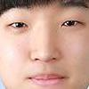
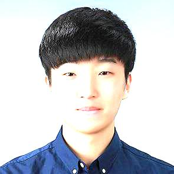
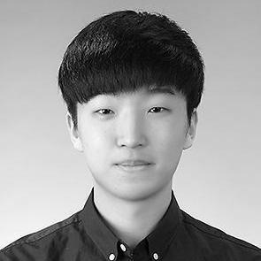
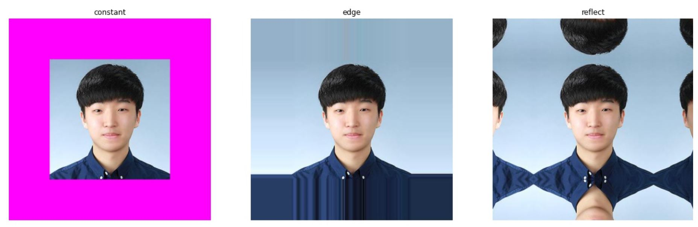
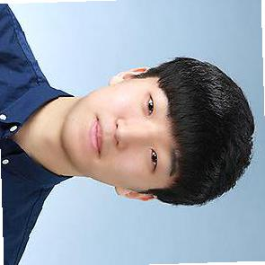
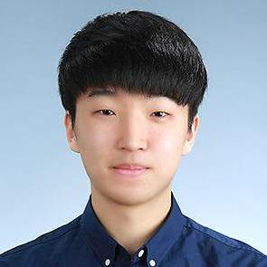
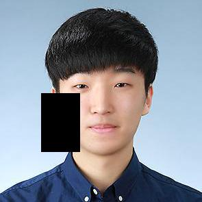

먼저 `Torchvision`이란 이미지를 이용해 기계학습을 할 때 유용하게 사용할 수 있는 라이브러리이다. `Torchvision`은 연구목적으로 하는 다양한 데이터셋을 제공하고 이미지 뿐만 아니라 Video데이터도 제공한다. 특히 이미지를 다룰 때 필수이며 이번 포스터에서도 다뤄볼 내용은 Transform 기능을 제공한다. 데이터셋에 대해서는 다른 포스터에서 다루기로 하고 이번에는 `Transforms`기능을 다뤄보기로 하자.


1. transforms이 무엇인지
2. 어떤 기능들이 있는지(변환과 부풀리기 2 종류 나눠서)
3. 실제로 프로젝트에 적용하는 방법
4. compose와 subscribale이 가능한 상태 설명
6. 

# Torchvision.Transforms()
<hr>

`Torchvision`에서 포함되어 있는 모듈인 `Transforms()`는 이미지 데이터를 학습에 맞게 변환하거나 부풀리기(Augmentaion) 등의 기능을 제공한다. `Transforms()`은 PIL Image나 Tensor Image,  Batch Tensor Image 등을 입력값으로 받는다. 여기서 Tensor Image는 (Channels, Height, Width)의 shape을 가지고 Batch Tensor Image의 경우 (Batch, Channel, Height, Width)의 shape을 가진다. Batch Tensor Image에서는 모든 Batch에 대해 변환이 동일하게 적용된다. 
<br>

Transforms을 적용하는 방식은 다음과 같다.(여러개를 동시에 적용)

```python
import torchvision.transforms as transforms

transform = transforms.Compose([
    transforms.ToTensor(),
    transforms.Normalize(),
    ......,
    ......,
])

transform(input_image)
```

- `Compose()` : 이 함수를 이용해 여러개의 변환을 한 번에 적용할 수 있다.

물론 각각 한 개씩도 적용할 수 있지만, 보통은 datasets을 불러올 떄 transforms을 사용하기 때문에 여러개의 변환들을 한 번에 적용하는 방법을 많이 사용한다.
<br>

지금부터 transforms으로 할 수 있는 기능들에 대해 나열할텐데, 예시에 사용될 사진은 다음과 같습니다.
```python
path = '../data/example.jpg'

img = Image.open(path)

plt.figure(figsize = (10,8))
plt.imshow(img)
```


# transforms() 의 종류
<hr>

그렇다면 transforms()으로 할 수 있는 변환들은 어떤 것들이 있을까?
(결과적으로 보면 대부분의 변환이 데이터를 부풀리는 효과가 있다.)

### 중심 자르기
```python
# 중심 자르기
img1 = transform.CenterCrop(size = (100,100))(img)
img1
```
- size에 맞게 이미지의 중심을 자른다.




### 밝기 및 명암 바꿔주기
```python
img2 = transform.ColorJitter(brightness=1, contrast=0, saturation=0, hue=0)(img) # 특정 수치 범위내에서 랜덤으로 바꿔준다
img2
```

- 특정 수치 범위내에서 랜덤으로 밝기 및 명암을 바꾼다.



### Image 5개 부위로 자르기
```python
# Image을 5개로 나누기
plt.figure(figsize = (20,30))
for i,im in enumerate(transform.FiveCrop(size = (50,50))(img)):
    plt.subplot(1,5,i+1)
    plt.imshow(im)
    plt.axis('off')
```

- 설정한 크기에 따라 5개의 사진으로 나눔


### Gray 스케일로 변환
```python
img3 = transform.Grayscale(num_output_channels=1)(img)
img3
```

- 채널이 1개 뿐인 gray scale로 변환
- 만약 `num_output_channels=3`으로 설정하면 `r==g==b`인 이미지로 변환한다.(결과는 같다.)



### 이미지 size 확장
```python
# Image을 5개로 나누기
plt.figure(figsize = (20,30))
mode = ['constant', 'edge', 'reflect']

for i, m in enumerate(mode): # 설정한 크기로 5개의 사진으로 나눔
    plt.subplot(1,3,i+1)
    im = transform.Pad(padding=(100,100), fill=(255,0,255), padding_mode=m)(img)
    plt.imshow(im)
    plt.title(m)
    plt.axis('off')
```

- `padding()`을 이용하여 이미지를 확장한다.
- 확장된 부분은 `fiil()` 옵션을 통해 색상을 채울 수 있다.
- `constant` : `fill`앞으로 동일하게 채운다.
- `edge` : 마지막 edge들의 값들로 채운다.(fill 옵션이 필요 없음)
- `reflect` : 거울처럼 반사된 모양으로 변환한다.



### 이미지 회전
```python
# 이미지 회전a
img5 = transform.RandomAffine(degrees=90, fillcolor=255)(img)
img5
```

- `degrees`의 각도만큼 회전, 회전 후에 남는 부분은 fillcolor로 채운다.
- `fiilcolor` 옵션은 PIL의 버젼이 5.0 이상일 때만 작동




### 무작위하게 자르기
```python
# 랜덤으로 자르기
img6 = transform.RandomCrop(size=(100,120))(img)
img6
```

- 해당 size만큼 무작위하게 이미지를 자른다.


### 확률에 따라 이미지를 gray scale로 변환
```python
img7 = transform.RandomGrayscale(p=0.5)(img)
img7
```

- p=확률값, 확률에 의해 이미지를 grayscale로 변환한다.
- p=0.5 설정 시 50%확률로 이미지가 grayscale로 변환된다.

### 확률에 의해 이미지 뒤집기
```python
# 랜덤하게 뒤집기
img8 = transform.RandomHorizontalFlip(p=0.9)(img)
img8
```
- 단순히 좌우(Horizontal)로 뒤집기 때문에 얼굴인 경우 변환의 차이가 별로 없다.(살짝 어색한 정도)



### 이지미 size 변경
```python
print(transform.Resize((100,100), interpolation=1))
print(transform.Resize((100,100), interpolation=2))
print(transform.Resize((100,100), interpolation=3))
print(transform.Resize((100,100), interpolation=4))
print(transform.Resize((100,100), interpolation=5))

transform.Resize((100,100), interpolation=2)(img)

# Resize(size=(100, 100), interpolation=PIL.Image.LANCZOS)
# Resize(size=(100, 100), interpolation=PIL.Image.BILINEAR)
# Resize(size=(100, 100), interpolation=PIL.Image.BICUBIC)
# Resize(size=(100, 100), interpolation=PIL.Image.BOX)
# Resize(size=(100, 100), interpolation=PIL.Image.HAMMING)
```

- 어떤 보간법(Interpolation)을 사용하느냐에 따라 살짝 다르게 변환된다.

### 무작위로 이미지 내의 부위 삭제
```python
tensor = transform.ToTensor()(img)
img9 = transform.RandomErasing(p=0.8, scale=(0.02, 0.33), ratio=(0.3, 3.3), value=0)(tensor)
plt.imshow(img9.permute(1,2,0))
```
- Tensor로 변환한 후 적용해준 이유는 `randomErasing()`이 적용될 때 input이 PIL Image이면 error가 발생한다.
- 확률적으로 발생하는데 신기하게 PIL Image일 때 적용되면 error가 발생하는데, 적용이 안 되면 에러가 발생하지 않음



<br>

위에서 다룬 것들은 대부분 이미지를 변환하는데 사용되는 함수들이다. 즉, Augmetation을 할 때 주로 사용되는 함수들인 셈이다. 하지만 이것 외에도 이미지의 값(value)을 변경해주는 기능도 있다. 대표적으로 사용하는 2가지를 소개하면 다음과 같다.

### Tensor 형식으로 변환

Pytorch에는 자체적으로 이미지를 불러오는 메소드가 없다. 따라서 PIL나 OpenCV 등의 모듈을 사용해서 우회적으로 이미지를 불러온다. 보통 Pytorch에서는 `JpegImageFile` 타입인 PIL을 이용해서 불러오게 되는데, 이는 `transforms()`가 `JpegImageFile`타입을 입력값으로 받기 때문이다.

```python
# Tensor 형식으로 바꿔주기
img10 = transform.ToTensor()(img)
img10
# tensor([[[0.5843, 0.5843, 0.5843,  ..., 0.5882, 0.5882, 0.5882],
#          [0.5843, 0.5843, 0.5843,  ..., 0.5922, 0.5922, 0.5922],
#          [0.5882, 0.5882, 0.5882,  ..., 0.5922, 0.5922, 0.5922],
#          ...,
#          [0.1686, 0.1686, 0.1843,  ..., 0.0784, 0.0863, 0.0902],
#          [0.1608, 0.1490, 0.1529,  ..., 0.0902, 0.0980, 0.1020],
#          [0.1529, 0.1294, 0.1255,  ..., 0.1059, 0.1137, 0.1137]],

#         [[0.6941, 0.6941, 0.6941,  ..., 0.6980, 0.6980, 0.6980],
#          [0.6941, 0.6941, 0.6941,  ..., 0.7020, 0.7020, 0.7020],
#          [0.6980, 0.6980, 0.6980,  ..., 0.7020, 0.7020, 0.7020],
#          ...,
#          [0.2549, 0.2510, 0.2706,  ..., 0.1451, 0.1529, 0.1569],
#          [0.2471, 0.2314, 0.2431,  ..., 0.1569, 0.1647, 0.1686],
#          [0.2392, 0.2157, 0.2157,  ..., 0.1725, 0.1804, 0.1804]],

#         [[0.7882, 0.7882, 0.7882,  ..., 0.7843, 0.7843, 0.7843],
#          [0.7882, 0.7882, 0.7882,  ..., 0.7882, 0.7882, 0.7882],
#          [0.7922, 0.7922, 0.7922,  ..., 0.7882, 0.7882, 0.7882],
#          ...,
#          [0.4157, 0.4196, 0.4549,  ..., 0.2627, 0.2706, 0.2745],
#          [0.4078, 0.4000, 0.4157,  ..., 0.2745, 0.2824, 0.2863],
#          [0.3922, 0.3765, 0.3882,  ..., 0.2824, 0.2902, 0.2902]]])
```

- PIL Image또는 numpy array를 Tensor로 바꿔주는 함수.
- `ToTensor()`는 value들을 자동으로 0~1사이의 값으로 스케일링한다.
<br>

**`Torchvision`의 모듈인 `datasets`을 이용할 때는 이미지를 불러올 때 PIL 라이브러리를 이용하기 때문에 `ToTensor()`를 필수적으로 사용해야한다.**


### 정규화(Normalization)

정규화를 해주는 이유에 대해서는 다른 포스터에서 다루기로 하고, 어떻게 적용되는지에 대해서만 다루겠다.

$$
z[channel] = \frac{x[channel] - mean[channel]}{std[channel]}
$$

```python
img11 = transform.Normalize(mean=(0,0,0), std=(2,2,2))(tensor)
img11
# tensor([[[0.2922, 0.2922, 0.2922,  ..., 0.2941, 0.2941, 0.2941],
#          [0.2922, 0.2922, 0.2922,  ..., 0.2961, 0.2961, 0.2961],
#          [0.2941, 0.2941, 0.2941,  ..., 0.2961, 0.2961, 0.2961],
#          ...,
#          [0.0843, 0.0843, 0.0922,  ..., 0.0392, 0.0431, 0.0451],
#          [0.0804, 0.0745, 0.0765,  ..., 0.0451, 0.0490, 0.0510],
#          [0.0765, 0.0647, 0.0627,  ..., 0.0529, 0.0569, 0.0569]],

#         [[0.3471, 0.3471, 0.3471,  ..., 0.3490, 0.3490, 0.3490],
#          [0.3471, 0.3471, 0.3471,  ..., 0.3510, 0.3510, 0.3510],
#          [0.3490, 0.3490, 0.3490,  ..., 0.3510, 0.3510, 0.3510],
#          ...,
#          [0.1275, 0.1255, 0.1353,  ..., 0.0725, 0.0765, 0.0784],
#          [0.1235, 0.1157, 0.1216,  ..., 0.0784, 0.0824, 0.0843],
#          [0.1196, 0.1078, 0.1078,  ..., 0.0863, 0.0902, 0.0902]],

#         [[0.3941, 0.3941, 0.3941,  ..., 0.3922, 0.3922, 0.3922],
#          [0.3941, 0.3941, 0.3941,  ..., 0.3941, 0.3941, 0.3941],
#          [0.3961, 0.3961, 0.3961,  ..., 0.3941, 0.3941, 0.3941],
#          ...,
#          [0.2078, 0.2098, 0.2275,  ..., 0.1314, 0.1353, 0.1373],
#          [0.2039, 0.2000, 0.2078,  ..., 0.1373, 0.1412, 0.1431],
#          [0.1961, 0.1882, 0.1941,  ..., 0.1412, 0.1451, 0.1451]]])
```

- 이미지의 value들을 (mean, std)로 정규화해준다.
- 모든 channel에 대해 각각 적용된다.

### 여러 변환들을 랜덤으로 적용

여러가지의 변환들을 한 번에 정의를 하고 확률에 따라 각 기능들이 발현될 수 있도록 하는 기능도 제공한다.
```python
# 여러 기능을 랜덤하게 적용하기(모두 적용이 된다.)
transforms = [
    transform.ColorJitter(brightness=1),
    transform.RandomAffine(degrees=180),
    transform.CenterCrop(size=(50,50))
]

transform.RandomApply(transforms, p=0.5)(img)
```

- 정해진 옵션에 따라 각 기능들이 적용된다.
- 확률(p)에 따라 적용된다.

<br>
<br>
<br>
<br>
<br>
<br>
<br>
<br>
<br>
<br>
<br>
<br>
<br>
<br>
<br>
<br>
<br>
<br>
<br>
<br>
<br>
<br>
<br>
<br>
<br>
<br>
<br>
<br>
<br>
<br>
<br>
<br>
<br>
<br>
<br>
<br>
<br>
<br>
<br>
<br>
<br>
<br>
<br>
<br>
<br>
<br>
<br>
<br>
<br>
<br>
<br>
<br>
<br>
<br>
<br>
<br>
<br>
<br>
<br>
<br>
