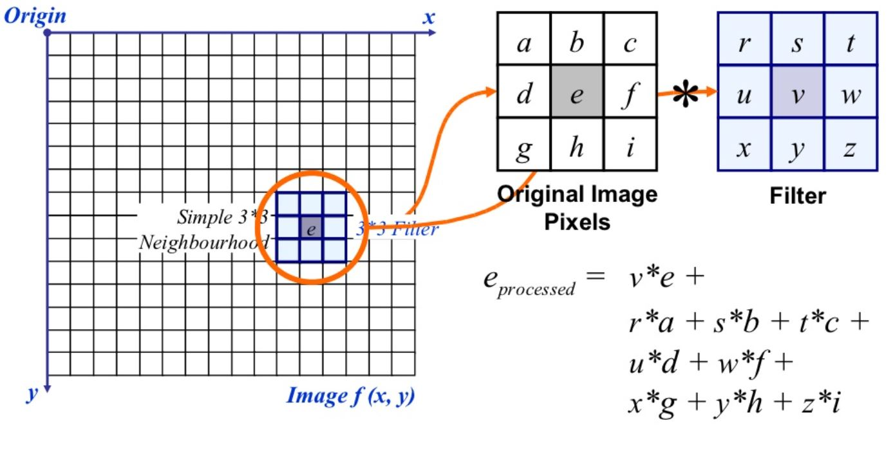
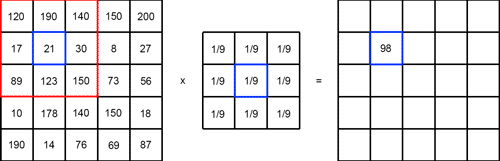
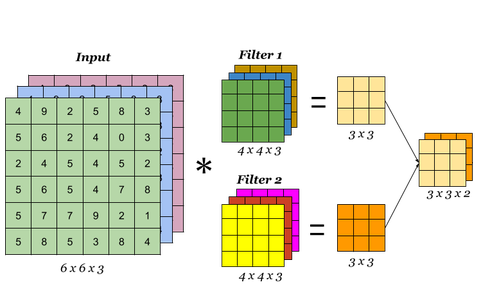

이번 포스터에서는 인공신경망 분야 중 하나인 ComputerVision의 기본이 되는 알고리즘인 **"Convolutional Neural Network"**에 대해 알아볼 것이다. CNN의 개념은 다른 분야에서도 많이 사용되고 있긴 하지만 이미지와 관련된 분야에서 획기적인 발전이 이루어졌다. CNN이 무엇인지 알아보고 Pytorch로 어떻게 구현하는지에 대해서도 다뤄보자.

# 이미지 필터링(Filtering)

사진을 찍고 편집을 해 본 경험은 누구나 다 있을 것이다. 얼굴에 잡티를 제거하거 좀 더 예쁘고 잘생기게 만들기 위해 턱을 깍고, 피부의 톤을 바꾸는 등이 있다. 사실은 이 작업들은 모두 **'필터(Filter)`**에 의해 작동이 된다. **필터링**이란 필터를 이용해 이미지를 이루고 있는 픽셀행렬에 여러가지 수식을 대입해 다른값으로 바꿔서 이미지를 변형하는 것을 말한다. 주로 잡티를 제거할 때 가장 많이 사용을 하는 필터인 블러(blur) 필터로 예를 들어보자.

위 사진은 **Blur Filter**를 사용한 결과이다. 이미지를 흐릿하게 만들어서 각중 노이즈를 제거하는 용도로 많이 사용된다. 이 필터를 사용자가 원하는 부위에 적용을 하면 잡티제거가 된다.
 

필터가 적용되는 방식은 다음과 같다.

위 사진은 3x3핕터가 이미지에 적용되는 모습이다. 이미지 픽설 위치에 각각 대응하는 필터의 값을 곱한 후 모두 더한다. 3x3필터는 총 9개의 값으로 구성되어 있기 때문에 이미지 픽셀의 9개 구역에 각각 대응하여 곱한 후 더한다. 필터는 옆으로 움직이면서 위와 같은 계산을 반복한다.

필터링을 통해 한 이미지를 다양하게 변환할 수 있고 상황에 알맞는 필터를 사용해 여러가지 정보들을 추출할 수 있다. 필터의 종류는 다음과 같다.

# 합성곱 신경망(Convolutional Neural Network, CNN)

위에서 언급한 필터링 기법을 인공신경망에 적용한 알고리즘이 바로 CNN이다. 1989년 LeCun에 의해 발표된 논문인 **"Backpropagation applied to handwritten zip code recognition"**에서 처음 소개되었고 이후에 2003년 Behnke이 작성한 **"Hierarchical Neural Networks for Image Interpretation"**을 통해 일반화되었다. CNN의 핵심은 이미지의 공간정보를 유지한다는 것이다. 즉, 이미지 내에 물체가 있다고 할 때 그 물체의 '모양'에 대한 정보를 추출할 수 있다는 뜻이다.

### CNN의 구조
CNN은 크게 3단계로 구성되어 있다. 
 - 이미지의 특징(정보)를 추출하는 단계(Convolution Layer)
 - 이미지를 축소하거나 '공간정보'를 유지해주는 단계(Pooling Layer)
 - 분류하는 단계(Fully-connected Layer)

### 합성곱 계층(Convolution Layer)
이미지에 필터링 기법을 적용해 여러가지의 특징을 추출하는 층이다. 핕터가 이미지에 적용되는 것과 계산방식이 동일하다. 다민 위에서 언급한 필터는 1x3x3(Channel, Width, Height)이었지만 Convolution Layer는 입력값의 의해 Channel수가 결정된다. 위 사진처럼 입력값이 RGB채널을 가진 이미지라면 입력값의 크기는 3@64x64(=3x64x64)이 되고, 이에 따라 filter의 크기는 3 x H x W가 된다. 여기서 H와 W는 모델 설계자가 정하는 값이다.

Input의 channel이 3이기 때문에 당연히 Filter1의 channel도 3이다. 

 <em>dfd </em> 

<figure>
    
    <figcaption> Image </figcaption>
</figure>

ddd
 
 
 
 
 
 
 
 
 
 
 
 
 
 
 
 
 
 
 
 
 
 
 
 
 
 
 
 
 
 
 
 
 
 
 
 