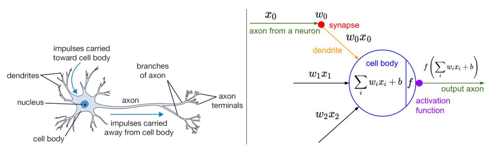
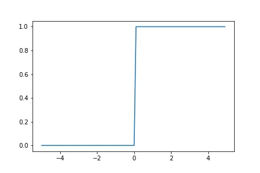
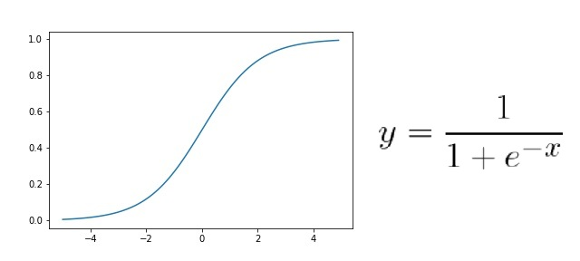
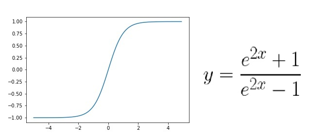
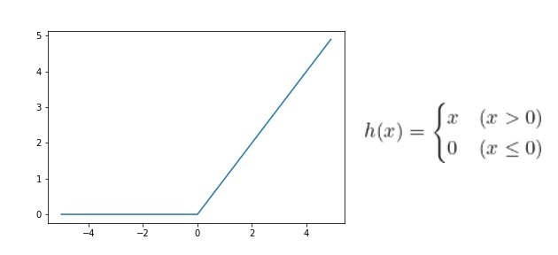

이번 포스터에서는 활성화 함수(Activation Function)에 대해 얘기해 볼 것이다. 딥러닝 모델을 설계할 때 각 층(Linear, CNN 등)에서 연산이 이루어지고 난 후 출력할 때 주로 활성화 함수를 거친 후에 출력이 된다. 딥러닝에서 필수적으로 사용되는 활성화 함수에 대해 알아보도록 하자.

# 활성화 함수(Function)
<hr>

우리 몸에는 신경을 전달하는 뉴런이 있다. 어느 부위에서 자극이 있으면 뉴런들은 그 자극을 뇌로 전달해서 우리가 느낄 수 있는 것이다. 하지만 뉴런들도 어느정도 강한 자극이 있거나 특정 임계점의 에너지가 작용해야 자극을 전달할 수 있다.

<br>

<center>

<figcaption> 사진1. 뉴런과 딥러닝 </figcaption>
<figcaption> 출처 : https://cs231n.github.io/neural-networks-1/ </figcaption>
</center>

<br>

뉴런의 원리가 딥러닝에서도 똑같이 적용이 되는데, 이처럼 특정한 임계값을 넘겨야만 옆으로 자극(연산결과)을 전달하는 것을 **활성화 함수(Activation Function)** 이라고 한다. 즉, 입력 신호의 총합을 출력 신호로 변환할 때 신호의 총합이 활성화를 일으키는지를 정하는 역할을 한다.

<br>

수식으로 보면 다음과 같다.

$$
\begin{aligned}
a &= b + w_1x_1 + w_2x_2\\
y &= h(a)\\
\end{aligned}
$$

위 식에서 가중치가 달린 입력 신호와 편향의 총합이 $a$이고 활성화 함수가 $h(x)$이다. $h(x)$가 임계값을 경계로 출력값을 바꾸기 때문에 '활성화'를 한다고 볼 수 있는 것이다.

<br>

활성화 함수의 가장 큰 특징 중 하나는 **비선형 함수** 를 이용한다는 것이다. 다시 말하면 **선형 함수**를 사용해서는 안 된다. 그 이유는 신겸앙의 층을 깊게 하는 의미가 없어지기 때문이다. 아래는 선형함수인 $h(x) = cx$를 사용했을 때의 수식이다.

<br>

$$
y = h(h(h(x))) = c*c*c*x = c^3x = ax
$$

<br>

위의 식처럼 은닉층이 없는 네트워크로 표시할 수 있다. 다시 말해 딥러닝 모델을 아무리 깊게 쌓아도 결국 1층 뿐인 것과 같은 효과가 나타나는 것이다. 따라서 모델의 층을 깊게 쌓는 혜택을 얻기 위해서는 활성화 함수를 **비선형 함수**로 사용해야 한다.

# 활성화 함수 종류
<hr>

활성화 함수에 대해 알아보았다. 그렇다면 종류에는 어떤 것들이 있을까?

<br>

### 계단 함수
비선형 활성화 함수 중 가장 간단한 함수이다. 어느 특정 입력값이 넘기 전까지 0 또는 다른 상수로 일정하다가 어느 값 이상이 되면 비연속적으로 증가하는 함수를 말한다.

<center>

<figcaption> 사진2. 계단 함수 </figcaption>
</center>

위 그림과 같이 함수 모양이 마치 계단처럼 생겼기 때문에 '계단함수'라고 불린다. 하지만 이 함수는 딥러닝의 시초인 '퍼셉트론'에서 사용하는 활성화 함수이고, 현재 딥러닝에서는 사용하지 않는다. 출력값이 급격하게 변하면서 많은 데이터의 손실히 발생할 가능성이 있기 때문이다.

<br>

### 시그모이드(Sigmoid) 함수

다음은 계단함수와 다르게 비교적 연속적인 비선형 함수인 시그모이드 함수이다.

<center>

<figcaption> 사진3. 시그모이드(Sigmoid) 함수 </figcaption>
</center>

<br>

시그모이드 함수의 특징으로는 계단함수보다 더 정교하고 자세한 '수치'를 표시할 수 있다는 것이다. 0 또는 1처럼 비연속적이지 않고 0.231처럼 연속된 값으로 표현되기 때문에 데이터에 대한 신뢰도가 더욱 상승한다.

<br>

하지만 아쉽게도 시그모이드 함수 또한 문제점을 가지고 있다. 입력값이 0에서 멀어질수록 미분값이 계속 작아져서 가중치 업데이트가 제대로 이루어지지 않는 기울기 손실(Gradient Vanishing) 문제가 발생한다. [경사하강법](https://gjustin40.github.io/pytorch/2020/12/13/Pytorch-GradientDescent.html)에서 가중치와 그 가중치의 미분값과 곱하면서 가중치를 갱신하는데, 여기서 0보다 작은 미분값을 계속 곱하다 보면 가중치값이 계속 작아져 제대로 갱신되지 않는 문제가 발생한다.

<br>

### 하이퍼볼릭 탄젠트(Tanh) 함수

<br>

시그모이드 함수의 또 다른 단점은 0과 1사이의 값으로 데이터를 한정한다는 데에 있다. 따라서 이 문제를 해결하기 위해 하이퍼볼릭 탄젠트 함수가 제안되었다.

<br>

<center>

<figcaption> 사진4. 쌍곡탄젠트(Tanh) 함수 </figcaption>
</center>

시그모이드 함수에 비해 출력값의 범위도 넓고 기울기의 변화가 더 크기 때문에 학습을 하는데 있어서 손실함수의 최솟값으로 더 빨리 다가갈 가능성이 있다. 하지만 아쉽게도 이 함수 또한 Gradient Vanishing 문제를 해결하지는 못 했다.

### ReLU(Rectified Linear Unit)

<br>

위에서 언급한 활성화 함수들의 가장 큰 문제점은 Gradient Vanishing 문제를 해결하기 위해 ReLU 함수가 제안되었다. 

<center>

<figcaption> 사진5. ReLU 함수 </figcaption>
</center>

그래프와 수식만 봐도 매우 간단한 함수인 것을 알 수 있다. 입력값이 0보다 크면 입력값 그대로 출력을 하고, 0보다 작으면 모두 0으로 출력한다.

<br>

ReLU 함수의 특징은 다음과 같다.
- 본질적으로는 비선형 함수에 속한다.
- ReLU 함수들의 조합 또한 비선형이다.
- 0보다 작은 값들을 0으로 출력하기 때문에 뉴런들을 제거함으로써 계산의 효율을 높인다.(모델의 가벼워진다.)
- 0보다 작은 값들은 0으로 출력하기 때문에 Gradient Vanishing 문제를 해결할 수 있다.
- 기울기값이 1이기 때문에 연산도 매우 간단하다.

ReLU 함수의 단점은 다음과 같다.("but nothing is flawless", 완벽한 건 없다.)
- 0보다 작은 값들에 대해서 Gradient Vanishing 문제가 발생하지는 않지만 애초에 오차값이 전달되지 않는 문제가 발생한다.(dying ReLU Problem)

# Pytorch 코드 실습

### 시그모이드(Sigmoid) 함수
```python
import torch
import torch.nn as nn

tensor = torch.randn(2)
sigmoid_func = nn.Sigmoid()

>>> print(tensor)
>>> print(sigmoid_func(tensor))
```

- `torch.randn(x)` : $N(0,1)$ 정규화 된 랜덤값을 출력한다.

### 하이퍼볼릭 탄젠트(Tanh) 함수
```python
tensor = torch.randn(2)
tanh_func = nn.Tanh()

>>> print(tensor)
>>> print(tanh_func(tensor))
```

<br>
<br>
<br>
<br>
<br>
<br>
<br>
<br>
<br>
<br>
<br>
<br>
<br>
<br>
<br>
<br>
<br>
<br>
<br>
<br>
<br>
<br>
<br>
<br>
<br>
<br>
<br>
<br>
<br>
<br>
<br>
<br>
<br>
<br>
<br>
<br>
<br>
<br>
<br>
<br>
<br>
<br>
<br>
<br>
<br>
<br>
<br>
<br>
<br>
<br>
<br>
<br>
<br>
<br>
<br>
<br>
<br>
<br>
<br>
<br>
<br>
<br>
<br>
<br>
<br>
<br>
<br>
<br>
<br>
<br>
<br>
<br>
<br>
<br>
<br>
<br>
<br>
<br>
<br>
<br>
<br>
<br>
<br>
<br>
<br>
<br>
<br>
<br>
<br>
<br>
<br>
<br>
<br>
<br>
<br>
<br>
<br>
<br>
<br>
<br>
<br>
<br>
<br>
<br>
<br>
<br>
<br>
<br>
<br>
<br>
<br>
<br>
<br>
<br>
<br>
<br>
<br>
<br>
<br>
<br>
<br>

