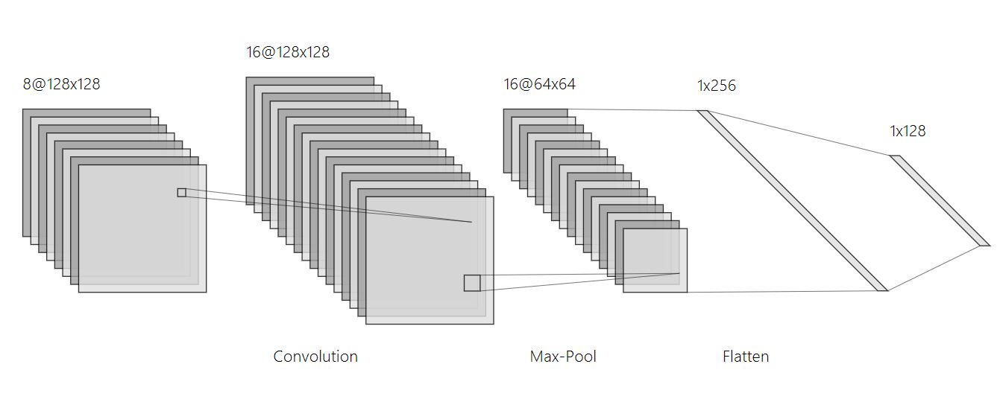
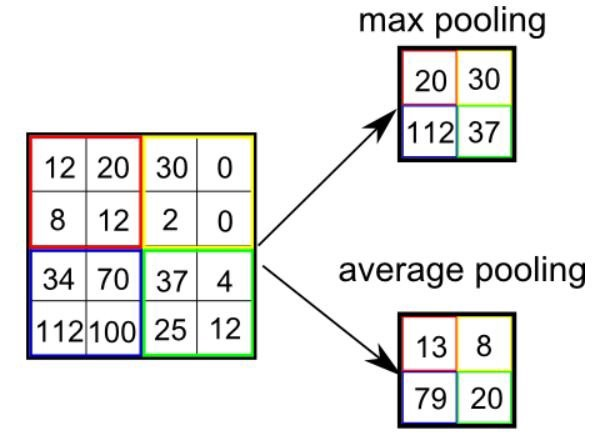
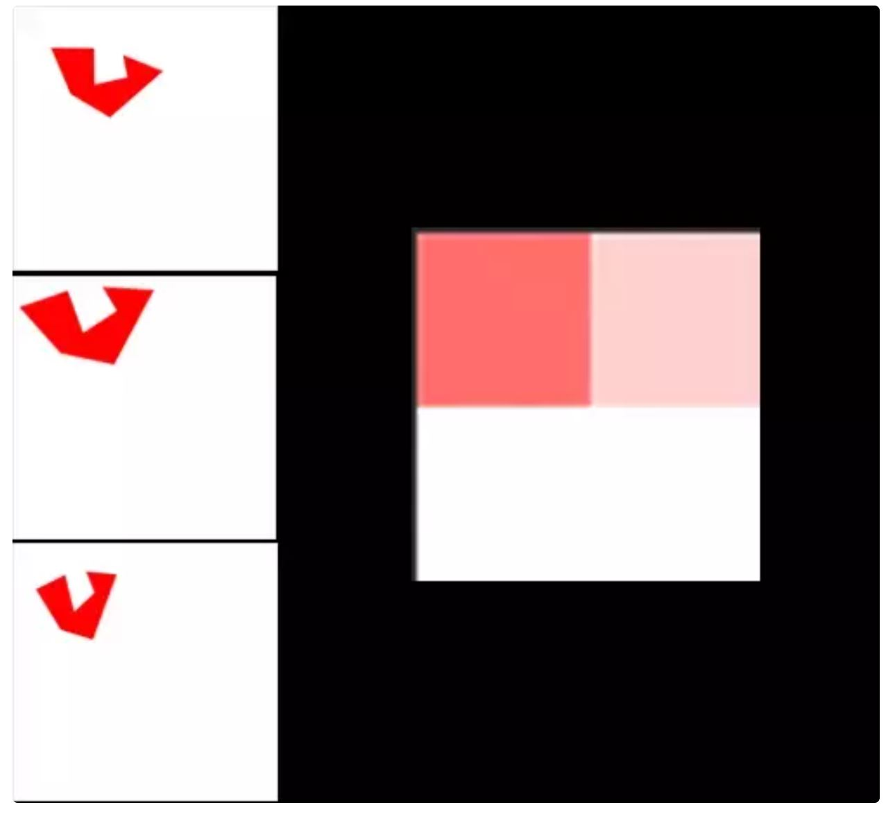
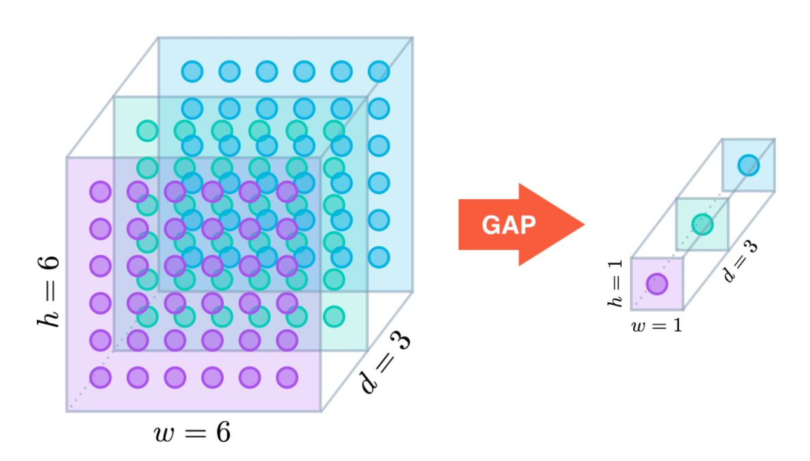
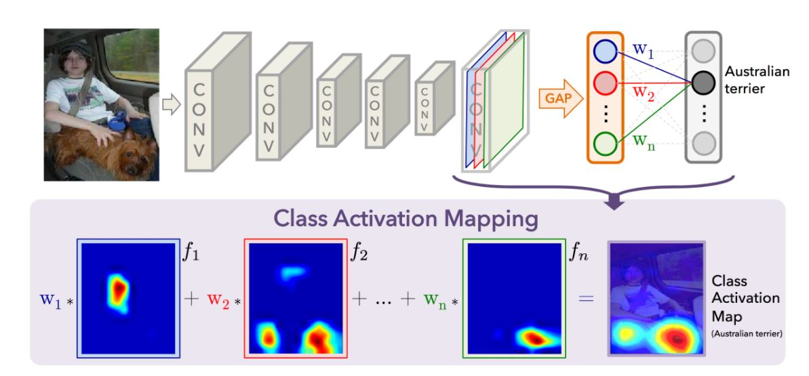

이번 포스터에서는 Convolution Layer을 거쳐서 나온 Feature maps을 Resizing 하여 새로운 Layer를 얻는 **폴링 계층(Pooling Layer)** 에 대해 알아보자.

# 폴링 계층(Pooling Layer)
<br>

CNN 알고리즘을 구성하는 필수적인 layer 중 하나인 Pooling Layer는 주로 Convolution Layer 연산을 거쳐 나온 Feature map이나 마지막 출력을 할 때 사용이 된다.

<center>

<figcaption> 사진1. Pooling Layer in CNN </figcaption>
</center>

<br>

Pooling Layer에서 사용하는 필터는 값이 따로 존재하지 않고 단지 '기능'을 수행한다. 즉, Matrix 연산을 사용하지 않고 이미지의 픽셀로부터 값을 뽑아내는 역할을 한다. 다른 Filter들과 동일하게 Size와 Stride을 설정할 수 있꼬 보통 Size는 2x2를 사용하고 Stride는 Size에 맞게 2로 설정한다.(stride를 1로 설정하여 overlapping을 할 때도 있다.)

<center>

<figcaption> 사진2. Pooling Layer </figcaption>
<figcaption> 출처 : https://towardsdatascience.com/a-comprehensive-guide-to-convolutional-neural-networks-the-eli5-way-3bd2b1164a53</figcaption>
</center>

<br>

### Pooling Layer 특징
Pooling Layer 특징은 다음과 같다.
- Convolution Layer 다음에 사용이 된다.
- 각 Feature Map에 대해 독립적으로 적용된다.<br>
(feature map의 channel이 3이면, pooling Layer의 channel도 3이다.)
- Feature Map의 Size를 줄인다.(DownSampling)
- 전체적으로 파라미터의 수와 연산량을 줄인다.(Computation 효율 증가)
- 작게나마 Overfitting에도 효과가 있다.(어느 정도 있다고는 한다....)

<br>

# Pooling Layer의 종류
<hr>

Pooling Layer읠 종류로는 약 4가지가 있다. 물론 Min-Pooling은 거의 사용하지 않지만, 그래도 Max가 있으면 그 반대도 있기 마련이기에 개념은 존재한다. 

<br>

### Min-Pooling
제목 그대로 2x2 Filter를 이용해 최솟값을 추출하는 방법이다. 물론 max가 있다면 min이 있는 건 당연하지만, Google에 검색을 아무리 해도 Min-Pooling을 사용하는 이유에 대해서는 정확히 언급된 사항이 없다. 최솟값을 추출하기 때문에 이미지가 전체적으로 어두어지는 효과가 있다. 

> 사용을 너무 안 하는 나머지 pytorch에서도 따로 메소드를 제공하지 않는다....나중에 구현해봐야겟네

<br>

### Max-Pooling
Min과 반대로 최대값을 추출하는 방법이다. 대부분의 pooling Layer들은 Size와 Stride을 2로 고정한다. 픽셀값 중 최대값을 추출하기 때문에 적용이 된 이미지는 보통 튀는 부분이 부각된다. Edge Filter와 비슷한 기능을 한다고 생각할 수 있다. 

<br>

Pytorch 코드는 다음과 같다.

```python
import torch.nn as nn
import torchvision.transforms as transforms
import PIL.Image as Image
import numpy as np
import matplotlib.pyplot as plt

img = Image.open('../data/example.jpg')
maxpool = nn.MaxPool2d(kernel_size=(2,2), stride=2)

img_tensor = transforms.ToTensor()(img)
img_maxpool = maxpool(img_tensor)

img_size = img.size
maxpool_size = np.array(img_maxpool).shape[1:]

plt.figure(figsize=(10,10))

plt.subplot(1,2,1)
plt.imshow(img)
plt.axis('off')
plt.title(f'Original {img_size}')

plt.subplot(1,2,2)
plt.imshow(np.array(img_maxpool.permute(1,2,0)))
plt.axis('off')
plt.title(f'MaxPool {maxpool_size}')

plt.savefig('maxpool_result.jpg', bbox_inches='tight')
```
- `nn.MaxPool2d()` : 2d라는 건 2차 Tensor에서 사용하는 MaxPooling Filter라는 뜻이다.
- `kernel_size`와 `stride` 옵션을 통해 크기를 설정할 수 있다.

<br>

<center>

<figcaption> 사진3. Original vs Maxpool </figcaption>
</center>

<br>

사실 위 사진에서는 튀는 부분을 부각?했다는 느낌은 들지 않지만 그래도 Maxpool이 적용된 사진을 보면 주위에 비해 유난히 튀는 부위만 남아있는 모습을 볼 수 있다. 

<br>

Max-Pooling Layer의 가장 큰 장점은 **Translation Invariance**의 효과이다. 이미지 내에 있는 물체가 이동을 해도 결과에는 변화가 없다는 뜻이다. 즉, 물체의 '고유'한 특징을 잘 잡아낼 수 있다.

<br>

아래 사진은 Translation Invariance을 가장 잘 보여주는 예시이다.

<center>

<figcaption> 사진4. MaxPooling Layer의 장점(Translation Invariance)
<figcaption> 출처 : https://www.quora.com/How-exactly-does-max-pooling-create-translation-invariance</figcaption>
</center>

<br>

### Average-Pooling
<br>

최솟값과 최댓값을 추출했다면, 마지막으로 **평균** 값을 추출하는 Pooling Layer도 있다. 느낌적으로 알 수 있듯이 주위 픽셀값의 평균은 곧 '불러' 효과를 준다. 노이즈를 줄이는 효과가 있다고 한다.

```python
img = Image.open('../data/example.jpg')
avgpool = nn.AvgPool2d(kernel_size=(2,2), stride=2)

img_tensor = transforms.ToTensor()(img)
img_avgpool = avgpool(img_tensor)

img_size = img.size
avgpool_size = np.array(img_avgpool).shape[1:]

plt.figure(figsize=(10,10))

plt.subplot(1,2,1)
plt.imshow(img)
plt.axis('off')
plt.title(f'Original {img_size}')

plt.subplot(1,2,2)
plt.imshow(np.array(img_avgpool.permute(1,2,0)))
plt.axis('off')
plt.title(f'AvgPool {avgpool_size}')

plt.savefig('avgpool_result.jpg', bbox_inches='tight')
```
- `nn.AvgPool2d()` : Max Layer와 동일하게 각종 옵션을 통해 크기를 설정할 수 있다.

<center>

<figcaption> 사진5. Original vs Avgpool </figcaption>
</center>

사진을 보면 아주 미세하게 흐려진 것을 알 수 있다. Blur 효과가 적용되었다는 뜻인데, 보통 노이즈를 줄이는 효과가 있다.


### Global Average-Pooling
<br>

사실 Average-Pooling Layer도 잘 사용하지 않는 추세이다. 단지 Blur의 효과를 얻기 위해서 사용하기에는 효율적이지 못 하기 때문이다. 하지만 **Global Average-Pooling Layer**는 여러 유명한 모델에서 사용되고 있다. Average-pooling Layer와 비슷한 개념이지만, 좀 더 넓은 범위에 대해 적용이 되기 때문에 **Global**이라는 단어가 추가되었다. 

<br>

**Global Average-Pooling**의 원리는 간단하다. 2x2, 3x3 등의 Filter를 이용하는 것이 아니라 Feature Map 전체에 대해 평균을 계산한다. 결국 Feature Map 1개당 1개의 벡터값이 나온다고 할 수 있다. 

<center>

<figcaption> 사진6. Global Average Pooling Layer </figcaption>
<figcaption> 출처 : https://alexisbcook.github.io/2017/global-average-pooling-layers-for-object-localization/</figcaption>
</center>

<br>

아래는 Global Averge Pooling Layer를 구현한 코드이다. Pytorch에서 따로 제공하는 메소드는 없고 Average-pooling Layer의 메소드를 활용해서 구현한다.

```python
img = Image.open('../data/example.jpg')
img_tensor = transforms.ToTensor()(img)

input_image = img_tensor.unsqueeze(0)
>>> print(input_image.shape)
#torch.Size([1, 3, 295, 295])

conv = nn.Conv2d(3,10,3)(input_image)
conv_shape = conv.shape
>>> print(conv_shape)
# torch.Size([1, 10, 293, 293])

global_avgpool = nn.AvgPool2d(kernel_size=conv_shape[2:])
>>> print(global_avgpool(conv))
# tensor([[[[ 0.2456]],
#          [[ 0.1059]],
#          [[ 0.2954]],
#          [[ 0.2536]],
#          [[-0.0453]],
#          [[-0.0066]],
#          [[-0.0869]],
#          [[-0.2485]],
#          [[ 0.3848]],
#          [[-0.4621]]]], grad_fn=<AvgPool2DBackward>)
```
- `unsqueeze()` : Convolution Layer의 입력값은 (batch, channel, W, H)이기에 batch의 차원을 하나 더 추가할 필요가 있다.
- `conv_shape[2:]` : Filter의 size를 입력되는 feature map의 size로 설정하면 Global Average pooling이 된다.
- `stride` : 어차피 Filter의 size가 곧 Feature Map의 size이기에 움직일 필요가 없다.<br>
(어떤 값이든 상관이 없다.)

<br>

**Global Averge Pooling Layer(GAP)**의 가장 큰 장점은 기존에 CNN에서 사용하던 Fully-connected Layer를 대체할 수 있다는 것이다. 대부분의 모델에서 파라미터의 수에 가장 큰 영향을 주던 부분이 Classifier를 하던 FC Layer이다. 따라서 이 부분을 대체함으로서 파라미터의 수를 급격하게 줄일 수 있었다.

또한 또 다른 장점으로는 **GAP**를 사용하면 Model을 좀 더 'Interpretable`하게 만들 수 있다는 것이다. 인간이 보이게 좀 더 직관적으로 이해할 수 있도록 해주는 효과가 있다는 뜻이다. 

<center>

<figcaption> 사진7. GAP의 장점 </figcaption>
<figcaption> 출처 : https://strutive07.github.io/2019/04/21/Global-average-pooling.html</figcaption>
</center>

Feature Map과 카테고리의 관계에 직접적으로 영향을 줘서 '공간정보'에 대한 손실을 최소화할 수 있다.

<br>

이 밖에도 여러가지 장점이 있다.

- 고정된 입력 size가 필요없다.(FC의 경우 고정된 input size가 필요하다.)
- 결론적으로 파라미터의 수를 감소시키기 때문에 과적합도 방지한다.

<br>

### Adaptive Pooling Layer
<br>

Pytorch에서 pooling Layer를 검색하면 Adaptive Pooling Layer도 있다는 것을 알 수 있다. 이 Layer의 경우에는 다양한 입력값의 크기에 따라 변할 수 있는 pooling Layer를 말한다. 즉, 위에서 언급한 Max, Average Layer들은 Filter와 stride가 하이퍼 파라미터이기 때문에 사용자가 직접 설정을 해줘야한다. 만약 input size가 변하면 그럴때마다 Filter와 Stride를 변경해줘야 하는 번거로움이 있다. 

<br>

하지만 Adaptive Pooling Layer는 output size를 설정해줌으로써 어떤 input size가 들어와도 사용자가 정의한 ouput size에 맞게 Filter의 size와 stride를 자동으로 설정해준다.
- `nn.AdaptiveMaxPool2d` : Max에 대한 Adaptive Pooling
- `nn.AdaptiveAvgPool1d` : Average에 대한 Adaptive Pooling

원하는 output size가 (10x10)이라고 가정하면 코드는 다음과 같다.

```python
adap_pool = nn.AdaptiveAvgPool2d(output_size=(10))

plt.figure(figsize=(10,10))

plt.subplot(1,2,1)
plt.imshow(img)
plt.axis('off')
plt.title('Original (295, 295)')

plt.subplot(1,2,2)
plt.imshow(np.array(adap_pool(img_tensor).permute(1,2,0)))
plt.axis('off')
plt.title('Adaptive Average Pooling (10,10)')

plt.savefig('adaptive_pool.jpg', bbox_inches='tight')
```
- `output_size` : (10)=(10x10)을 의미한다.

<br>

<center>

<figcaption> 사진8. Adaptive Average Pooling Layer </figcaption>
</center>

사용자가 원하는 ouput_size만 설정하면 되기 때문에 모델을 설계할 때 매우 유용하게 사용될 것 같다.

# pooling Layer를 사용하는 이유
<hr>

Layer들에 대해 설명을 하면서 각각의 장점에 대해 언급을 했다. 가장 큰 이유로는 이미지의 사이즈를 줄여 연산량을 줄이는 **DownSampling**을 하기 위해서이고, Convoultion Layer에서 추출한 정보들을 좀 더 강화하기 위해 사용하기도 한다. 따라서 Convolution Layer와 떨어질 수 없는 한 세트라고 생각해야한다.

<br>

지금까지 pooling Layer들의 종류에 대해 알아보았다. CNN을 다룬다면 반드시 나오는 Layer이기 때문에 자세히 알아두면 매우 좋을 것 같다. 사실 위에서 언급한 Layer들 말고도 Max와 average를 혼합한 테크닉도 있다. 나중에 기회가 된다면 좀 더 발전된 Pooling Layer들에 대해 다뤄보도록 하겠다.

## **읽어주셔서 감사합니다.(댓글과 수정사항은 언제나 환영입니다!)**