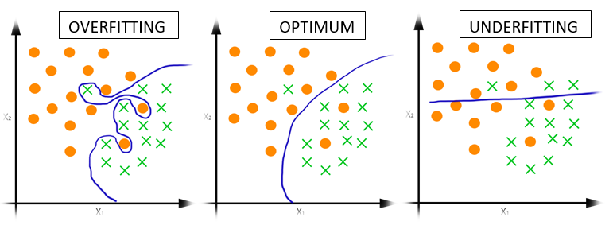

이번 포스터에서는 기계학습을 하다보면 자주 겪는 과적합(Overfitting)에 다뤄보도록 하겠다.

 

# 과적합(Overfitting) 이란?

이름에서도 알 수 있듯이 **과적합(Overfitting)** 이란 '학습데이터에 과하게 학습이 되었다'는 뜻이다. 기계학습을 통해 학습을 하다보면 **학습데이터**에 대한 손실함수가 감소하는 방향으로 모델이 학습이 되지만, **실제데이터** 에 대한 오차가 감소하지 않거나 학습 데이터에 대한 오차가 어느 지점부터 증가하는 순간을 말한다. 즉, Training Datasets에 대해서만 너무 적합한 모델이 되어버린 상태이다.

<figcaption> 과적합 </figcaption>
<figcaption> 출처 : http://mlwiki.org/index.php/Overfitting</figcaption>

### 일반화(Generalization)
 

다음과 같이 입력값(X)에 대해 출력값(Y)을 예측하는 모델이 있다고 하자.

 

$$
Y = f(X)
$$

 

모델이 '학습'한다는 것의 의미는 입력값(X)에 대해 출력값(Y)을 예측하는 $f()$를 찾는 것이다. 풀고자 하는 문제(Classification, Object Detection, etc)에 대해 적절한 데이터(X)을 사용해서 원하는 예측값(Y)을 출력하는 $f()$를 구해야하는데, 이때 가장 중요한 것은 **실제 데이터(test Dataset)**에 대해서 잘 작동해야 한다는 것이다.

 

다시 말하면 모델을 '학습 데이터'를 이용해 학습을 하지만, 실제로 모델이 예측해야 하는 건 학습에 참여하지 않았던 '실제 데이터'인 것이다. 사실 '학습 데이터'는 '실제 데이터'의 일부를 나타내기 때문에 결국 '실제 데이터'에 대해서 예측을 하지 못 하면 아무 쓸모없는 모델이 된다. 

 

> **우리가 수집한 데이터는 실제의 일부이고 불완전하고 노이즈가 많기 때문에 New Data에 대해 일반화(Generalization)가 될 필요가 있다.** 

 

<figcaption> 모델의 성능 </figcaption>
<figcaption> 출처 : https://medium.com/@srjoglekar246/overfitting-and-human-behavior-5186df1e7d19</figcaption>

 

### 과적합이 발생하는 이유
 

과적합이 발생하는 이유는 매우 다양하지만, 대표적으로 다음과 같다.
- 학습 데이터에 노이즈가 많은 경우
- 모델이 너무 복잡할 때(=파라미터의 수가 많을 때)
- 학습하는 데이터가 매우 부족할 때

 

### 모델의 복잡성(Parameter의 수)과 과적합의 관계

 

사실 필자가 공부를 하면서 가장 궁금했던 부분이라 따로 다루고 싶었다. 특히 [Pooling Layer](https://gjustin40.github.io/pytorch/2020/12/25/Pytorch-PoolingLayer.html)에 대한 포스터를 만들 때 많은 의문이 들었다. Pooling Layer를 사용하면 parameter의 수를 줄이기 때문에 과적합을 방지할 수 있다고 한다. 대체 무슨 관계가 있는걸까?

 

복잡하게 생각할 필요가 없었다. 파라미터의 수가 많다는 것은 데이터에 대해 좀 더 '세세하게' 학습을 할 수 있다는 것을 의미한다. 즉, 불필요한 부분까지 학습을 하게 되고 결론적으로 '암기'가 되어버리기 떄문이다.

 

예를 들어 이미지 데이터 안에 '댕댕이'의 유무를 구별하는 모델이 있다고 하자. 만약 복잡한 모델로 학습을 하게 되면 이미지 속 '댕댕이'의 고유한 특징을 잡아낼 뿐만 아니라 '댕댕이'를 제외한 주변 '노이즈'까지 전부 학습을 하게 된다. 그러면 결국 '댕댕이'가 없는 이미지인데도 불구하고 주변 '노이즈'를 인식해서 '댕댕이'가 있다고 예측하는 경우가 생긴다. 결국 '댕댕이'를 구별했다기 보다는 '학습 데이터' 자체의 특징을 잡아내서 학습을 한 결과가 나온 것이다. 

 

### 과적합 탐지

 

학습 도중에 과적합이 발생했다는 것을 어떻게 알 수 있을까? 가장 좋은 방법은 학습 데이터를 Train과 Validation로 나눠서 각각의 Loss를 확인하는 것이다. 

<figcaption> Train과 validation Loss 확인 </figcaption>

 

위 Loss의 그래프처럼 Train과 Validation을 비교했을 때 Train의 loss는 감소하고 있는 반면 Validation의 Loss가 증가하는 추세가 보이면 overfitting이 되었다고 볼 수 있다. 

 
 
 
 
 
 

