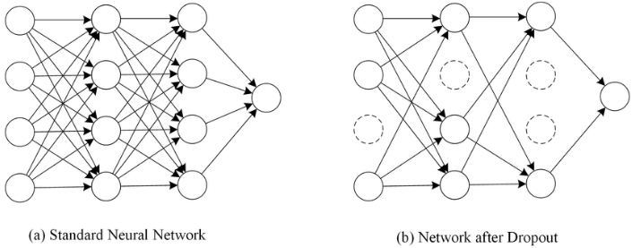

오늘은 과적합을 방지하는 테크닉 중 하나인 Drop Out에 대해 알아보도록 하자.

# Deep Learning의 문제점

### 과적합(Overfitting)
 

과적합이란 모델이 학습 데이터에 대해서만 지나치게 학습한 나머지 **일반화**되지 못해서 실제 데이터에서는 Loss값이 감소하지 않고 좋은 성능을 보이지 못 하는 현상을 말한다. [여기](https://gjustin40.github.io/pytorch/2020/12/28/Pytorch-Overfitting.html)를 참고하면 자세히 알 수 있듯이 'Training Datasets에 대해서만 매우 적합한 모델이 된 상태'를 말한다. 

 

과적합이 발생하는 이유는 다양하지만, 대표적으로 다음과 같다.
- 학습 데이터에 노이즈가 많은 경우
- 모델이 너무 복잡할 때(파라미터의 수가 많을 때)
- 학습하는 데이터가 매우 부족할 떄

 

### Co-adaptation(동조현상)
 

인공신경망 구조의 본질적인 이슈중 하나로 Co-adaptation가 있다. 모델을 학습시킬 때 학습 데이터에 의해 weight들이 서로 동조화되는 현상이다. 즉,weights들이 다른 weight에 의존하게 되면서 서로 영향을 주는 현상을 말한다.
- 특정 Weight가 너무 커버리면 다른 weight들의 영향이 상대적으로 적어진다.
- 비슷한 feature를 detect하는 뉴런이 발생하면 결국 computation 낭비로 이어진다.

 

따라서 각 뉴런들 독립적으로 feature를 추출할 수 있도록 분리해줄 필요가 있다.

# Drop Out

위에서 언급한 2가지 문제를 해결하기 위해 Drop Out 방법이 제시되었다.(물론 Ensemble효과 있지만, 이건 얻어지는 '효과'에서 다루기로 하겠다.) Drop Out이란 모델의 일부 네트워크를 생략하는 것을 말한다. 네트워크 속 노드를 강제로 랜덤하게 0값으로 만들어서 해당 노드가 학습에 참여하지 않도록 한다. 

 

<figcaption> Drop Out </figcaption>
<figcaption> 출처 : https://wikidocs.net/61374 </figcaption>

 

Drop Out을 적용할 때는 확률값($p$)를 이용한다. '각 뉴런이 생략되지 않을 확률($p$)'을 이용해 뉴런의 생사를 결정한다. 모델이 학습을 할 때 $p$값에 의해 뉴런이 랜덤적으로 0값이 되고, 결과적으로 매 학습마다 다른 모델을 학습하는 것과 같아진다. 이 현상은 결국 Ensemble(앙상블)효과를 야기시킨다.

 

### Drop Out의 효과
 

위에서 언급했듯이 각 뉴런들이 동조화 되는 **Co-adaptation**를 방지하는 효과가 있다. 보통의 신경망에서는 weight들이 서로 연결되어있고 한 뉴런으로 모이면서 각자가 어떤 영향을 주는지 알고 있는 상태이다. 따라서 loss를 갱신할 때 서로에게 영향을 준다. Drop out을 통해 학습을 하는 동안, 서로 영향을 주던 weight들의 관례를 break함으로서 각 뉴런들이 독립적으로 feature를 추출할 수 있도록 해준다.

<figcaption> Effect of Feature </figcaption>
<figcaption> 출처 : Dropout: A Simple Way to Prevent Neural Networks from
Overfitting </figcaption>

 

보통 신경망에서 모델을 결합하면 학습의 성능을 개선할 수 있다. 서로 다른 구조의 모델을 학습을 하는 경우를 말한다. 하지만 신경망이 깊어질수록 여러개의 모델을 학습하는 것은 무리가 있다. Drop Out은 이러한 문제를 해결하는 동시에 **모델 결합(Model Combination)** 효과를 야기한다.

 

Drop Out 기법으로 인해 랜덤으로 뉴런을 생략하면 투표호과(voting)를 내면서 학습을 진행하게 된다. 즉, 생략된 뉴런이 매 학습마다 다양하기 때문에 마치 다른 모델을 학습한 것 같은 효과를 준다. 상대적으로 'thin' 한 여러 네트워크를 샘플링하여 모델을 test할 때 예측값을 평균내는 효과를 내서 **과적합**을 방지하고 **Regularization** 효과를 준다.

<figcaption> Model Combination </figcaption>
<figcaption> 출처 : Dropout: A Simple Way to Prevent Neural Networks from
Overfitting </figcaption>

 

### Drop Out이 Co-adaptation을 방지하는 더 직관적인 이유
 

포스터에서 자주 말했듯이 필자는 많이 멍청해서 '쉽게 설명된 것'을 찾아다니느라 애를 쓴다. "Dropout: A Simple Way to Prevent Neural Networks from Overfitting"라는 논문에 이런 표현이 있었다.

 

> Drop out은 가끔씩 뉴런들을 없애서 평소에는 서로 영향을 주던 뉴런들이 '없는 상태'에서 loss값을 감소시켜야 한다. 즉, 서로를 신뢰하지 못하도록 만든다. 따라서 결과적으로 각 뉴런들은 각자 독립성을 키울 수 있게 된다.

 

원본은 다음과 같다.(나름대로 MSG를 첨가해서 필자만의 언어로 해석했습니다.)

 

>We hypothesize that for each hidden unit, dropout prevents co-adaptation by making the presence of other hidden units unreliable. Therefore, a hidden unit cannot rely on other specific units to correct its mistakes. It must perform well in a wide variety of different contexts provided by the other hidden units. To observe this effect directly, we look at the first level features learned by neural networks trained on visual tasks with and without dropout.

 

### Drop out이 적용되는 방식
 

Drop Out은 Training을 할 때 적용이 된다. 생략되지 않을 확률($p$)에 따라 학습 간에 뉴런이 생략이 된다. 이후에 Test를 하게 되면 $p$가 적용됐던 뉴런에서 나가는 Weight값에 대해 각각 $p$값을 곱해준다. 각 Weight들은 $p$확률로 출현하기 때문에 곱해주는 것이다. 

 

<figcaption> Drop Out 적용 </figcaption>
<figcaption> 출처 : Dropout: A Simple Way to Prevent Neural Networks from
Overfitting </figcaption>

