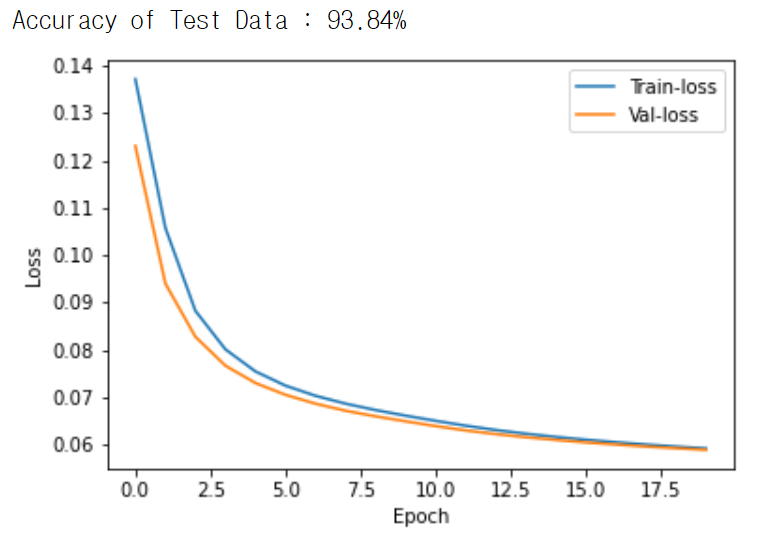

오늘은 CNN 모델의 시초이자 Classification의 초기 모델인 LeNet-5 모델에 대해 알아보도록 하겠다. CNN에 대해서는 [여기](https://gjustin40.github.io/pytorch/2020/12/20/Pytorch-CNN.html)에 자세히 적어놓았고, 이번 포스터에서는 모델에만 집중하도록 하겠다. **모델에 대한 코드가 필요하면 [여기](https://github.com/gjustin40/Pytorch-Cookbook/blob/master/Advanced/LeNet/LeNet-5.ipynb)를 참고하길 바랍니다.**

<br>

# LeNet
<hr>

LeNet은 프랑스 출신 과학자인 Yann LeCun에 의해 고안되었으며 이 분은 CNN의 개념을 최초로 개발한 사람이기도 하다. 본인이 개발한 CNN을 적극 활용하여 우편번호와 수표의 필기체를 인식하는 기술을 개발하였으며 그 뒤로도 다양한 모델들을 고안했다. 

<br>

LeNet은 [Gradient-Based Learning Applied to Document Recognition](http://yann.lecun.com/exdb/publis/pdf/lecun-98.pdf)이라는 논문에서 소개가 되었다. 논문을 보면 46쪽으로 매우 긴데, CNN 기술이 나오고 얼마 안 돼서 태어난 모델이기 때문에 이것저것 설명할 것들이 많아서 그런 것 같다. 사실 대충 훑어보면 필자가 포스팅한 여러 테크닉들을 다 적어놓았다고 보면 된다.

<br>

### DataSet

<br>

위에서도 언급했듯이 원래 우표번호나 필기체를 인식하기 위해 고안한 모델이기 떄문에 데이터는 '숫자를 손글씨로 적인 이미지'인 **MNIST** 데이터이다. 다행히 Pytorch에서도 제공하는 Dataset이기 떄문에 코드를 작성할 때 매우 유용하다. MNIST는 0~9까지의 숫자가 있고 약 6만개의 Training set과 약 1만개의 Test set으로 구성되어 있다. 

<br>

<center>

<figcaption> MNIST Dataset</figcaption>
</center>

<br>

### Model Architecture
<br>

우리가 다룰 LeNet 모델은 사실 LeNet-5 모델이고, 1~4까지는 5와 매우 흡사하지만 크기와 각종 kernel size에서 차이가 있다. 따라서 그냥 5모델로 봐도 무방하다. 필자도 궁금해서 1~4까지의 모델을 열심히 찾아봤지만 그 어디에도 모델을 정확히 보여주는 자료는 없었다. <br>
모델의 구조는 다음과 같다.

<br>

<center>

<figcaption> Architecture of Lenet5 </figcaption>
<figcaption> 출처 : http://yann.lecun.com/exdb/publis/pdf/lecun-98.pdf </figcaption>
</center>

<br>

- Convolution Layer 2개 사용
- Fully-connetected Layer 3개 사용
- 중간에 Average Pooling Layer 2개 사용(Subsampling)
- 활성화 함수는 Tanh를 사용


<br>

입력 이미지는 32x32x1(channel) 이미지이고 두 Convolution Layer의 필터 사이즈는 5x5이다. 각각 6개와 16개의 Feature map을 생성하고 tanh함수를 거쳐서 average Pooling Layer를 거친다. 최종적으로 만들어진 16개의 Feature map은 Fully-connected Layer로 가서 10개의 출력값을 낸다.(0부터 9까지의 숫자)

<br>

사진을 보면 마지막에 **'Gaussian Connections'** 부분이 있는데, 예측값과 정답값의 차이를 계산하기 위해 사용한 방사형 기저 함수(RBF)를 나타낸다. 하지만 현재 사용하고 있는 Cross Entropy Error와 똑같은 함수이고 심지어 CEE가 더효율적이라 대체되었다. 

<br>

### Optimizer / Loss Function
<br>

논문에서는 가장 기본 Optimizer인 [SGD(Stochastic Gradient Descent)](https://gjustin40.github.io/pytorch/2020/12/13/Pytorch-GradientDescent.html)를 사용했다. 또한 Loss Function으로는 이미지를 다룰 때 대부분의 모델에서 사용하는 Cross Entropy Loss를 사용했다. Learning Rate는 0.001로 설정했고 Momentum은 아직 개념이 나오기 전이라 사용하지 않았다.

<br>

### Result
<br>

총 20개의 Epoch을 사용했고 학습을 하던 중 10-12 epoch 정도에 안정적인 loss값이 형성된다. Test했을 때 약 95%의 정확도가 나왔다.

<br>

# Pytorch 실습
<hr>

사실 LeNet-5 너무 초기모델이고 CNN 개념이 막 나왔을 때라 현란한 테크닉이 딱히 없어서 설명할 내용이 그렇게 많지는 않다. 

<br>

**MNIST**를 사용했기 때문에 Pytorch에서 제공하는 함수를 이용했다.

```python
import torch
import torch.nn as nn
import torch.optim as optim
from torch.utils.data import DataLoader, random_split
from torchvision import transforms, datasets
import torchvision.transforms as transforms
import numpy as np
import matplotlib.pyplot as plt

transform = transforms.Compose([transforms.Resize((32,32)),
                                transforms.ToTensor(),
                                transforms.Normalize(mean=[0.5], std=[0.5])])

train_dataset = datasets.MNIST(root='../../data', train=True, download=True, transform=transform)
test_dataset = datasets.MNIST(root='../../data', train=False, download=True, transform=transform)

train_dataset, val_dataset = random_split(train_dataset, (55000, 5000))

train_loader = DataLoader(train_dataset, batch_size=16, shuffle=True)
val_loader = DataLoader(val_dataset, batch_size=16, shuffle=True)
test_loader = DataLoader(test_dataset, batch_size=8, shuffle=False)
```

Validation Datasets을 따로 나눈 이유는 Loss값이 잘 감소하고 있는 확인하기 위해서다. Test는 정말 마지막에 모델의 성능을 확인하는 용도로 사용해야기 때문에 Validation dataset까지 이용하였다. Validation Datset을 이용하면 과적합을 초기에 방지할 수 있는 효과가 있다.

<br>

모델의 구조는 다음과 같다.
```python
    
    def __init__(self):
        super(Lenet5, self).__init__()
        
        self.conv1 = nn.Conv2d(1, 6, 5)
        self.conv2 = nn.Conv2d(6, 16, 5)
        
        self.avgpool = nn.AvgPool2d(2,2)
        
        self.fc1 = nn.Linear(5*5*16, 120)
        self.fc2 = nn.Linear(120, 84)
        self.fc3 = nn.Linear(84, 10)
        
    def forward(self, x):
       
        x = torch.tanh(self.conv1(x))
        x = self.avgpool(x)
        
        x = torch.tanh(self.conv2(x))
        x = self.avgpool(x)
        
        x = x.view(-1, 16*5*5)
        
        x = torch.tanh(self.fc1(x))
        x = torch.tanh(self.fc2(x))
        x = torch.tanh(self.fc3(x))
        
        return x
```

- `view(-1, a)` : 열의 크기가 a로 고정하고 수치에 맞게 행은 자동으로 결정

<br>

Optimizer와 Loss Function은 다음과 같다.

```python
loss_func = nn.CrossEntropyLoss()
optimizer = optim.SGD(model.parameters(), lr=0.001)
```

<br>

비록 모델이 작긴 해도 GPU의 강력함을 활용하기 위해 Cuda를 이용했다.

```python
if torch.cuda.is_available():
    device = torch.device('cuda')
else:
    device = torch.device('cpu')
>>> print(device)
# cuda
```

<br>

20 Epoch 동안에 훈련을 실시했고 train과 validation의 loss값은 따로 저장해서 나중에 그래프로 감소하는 양상을 확인했다.

```python
EPOCH = 20
train_loss_list, val_loss_list = [], []

for e in range(EPOCH):
    
    train_loss = 0
    train_correct = 0
    
    model.to(device)
    model.train()
    
    for i, data in enumerate(train_loader):
        images, labels = data
        images, labels = images.to(device), labels.to(device)
        
        optimizer.zero_grad()
        
        output = model(images)
        
        loss = loss_func(output, labels)
        
        loss.backward()
        
        optimizer.step()
        
        train_loss += loss.cpu().item()
        
        pred = output.argmax(1)
        train_correct += (pred == labels).cpu().sum().item()
        
    train_acc = train_correct / len(train_dataset)
    train_loss = train_loss / len(train_dataset)
    train_loss_list.append(train_loss)
    
    val_loss = 0
    val_correct = 0
    
    model.eval()
    
    with torch.no_grad():
        for i, data in enumerate(val_loader):
            images, labels = data
            images, labels = images.to(device), labels.to(device)
            
            output = model(images)
            
            loss = loss_func(output, labels)
            
            val_loss += loss.cpu().item()
            
            val_pred = output.argmax(1)
            val_correct += (val_pred == labels).cpu().sum().item()
            
        val_acc = val_correct / len(val_dataset)
        val_loss = val_loss / len(val_dataset)
        val_loss_list.append(val_loss)
    
    info = '[EPOCH {}/{}] : train-loss = {:0.4f} | train-acc = {:0.4f} | val-loss = {:0.4f} | val-acc = {:0.4f}'
    print(info.format(e+1, EPOCH, train_loss, train_acc, val_loss, val_acc))
    
    torch.save(model.state_dict(), '../../data/weight')
```
- `train_loss_list` : train할 때 loss값
- `val_loss_list` : Validation의 loss값
- `cpu()` : Cuda를 사용해서 GPU에 Tensor들을 올렸기 때문에 cpu로 옮기지 않고 계속 계산하면 GPU에 메모리가 쌓인다. 따라서 따로 분리를 해줘야한다.
- `argmax(1)` : 각 행에서 가장 높은 값의 index를 반환한다.
- `torch.save()` : 모델의 weight값들만 저장을 해서 나중에 재활용할 수 있도록 했다.

<br>

마지막으로 Loss가 감소하는 양상과 Test를 통해 정확도를 확인했다.

```python
model.cpu()
model.eval()

test_correct = 0

with torch.no_grad():
    for data in test_loader:
        images, labels = data

        prediction = model(images)
        
        test_correct += (prediction.argmax(1) == labels).sum().item()
        
    
    test_acc = test_correct / len(test_dataset)
    print('Accuracy of Test Data : %0.2f%%' %(test_acc*100))

plt.plot(train_loss_list)
plt.plot(val_loss_list)

plt.xlabel('Epoch')
plt.ylabel('Loss')
plt.legend(['Train-loss', 'Val-loss'])

plt.show()
```
- `eval()` : 모델을 test모드로 변경해서 Dropout 등의 기능을 off한다.
- `no_grad()` : 계산이 이루어질 때 자동미분 기능을 off한다.

<center>

<figcaption> Loss </figcaption>
</center>

<br>

지금까지 CNN의 시초모델인 LeNet-5에 대해 알아보았다. 시초인 만큼 Layer의 수도 매우 적고 특별한 테크닉도 없어서 구현하기 매우 쉽다. 따라서 모델을 막 구현하기 시작하는 사람에게는 LeNet-5를 공부하면 매우 좋은 경험이 될 것 같다.

<br>

## **읽어주셔서 감사합니다.(댓글과 수정사항은 언제나 환영입니다!)**