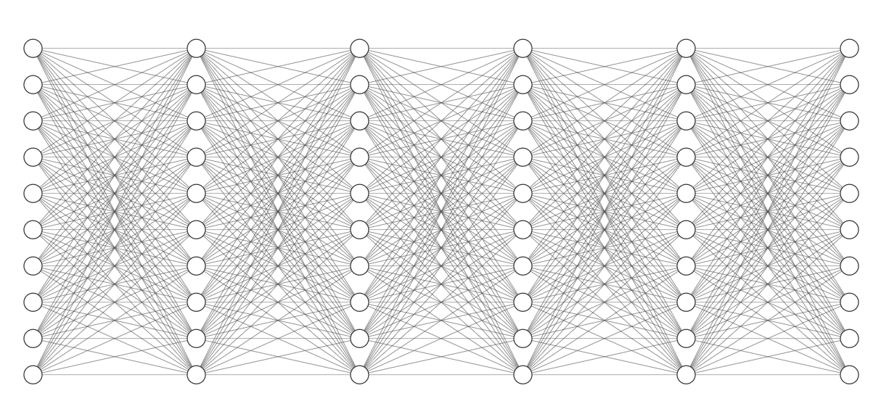
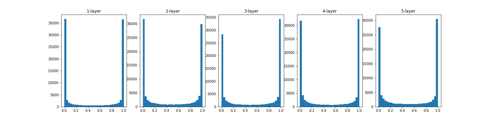
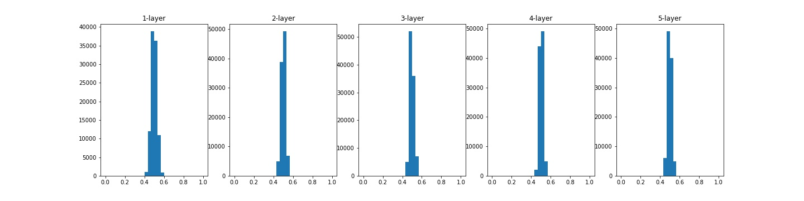

오늘은 신경망 학습에서 중요한 요소 중 하나인 가중치(weight)의 초기화에 대해 알아보도록 하자.

# 가중치의 초깃값

딥러닝이 막 사용되기 시작할 때는 초기값에 대한 관심이 별로 없었다. 초반에는 모델의 크기도 작았고 '딥러닝' 기술 자체에 관심을 가졌기 때문에 관심을 갖지 않았다. 하지만 모델이 커지고 깊어지면서 정확하고 빠르게 학습하기 위해서는 가중치의 초기값이 매우 중요하다는 사실이 밝혀지면서 많은 연구자들이 관심을 가지게 되었다. 

 

**가중치의 초깃값**이 중요한 이유는 다음과 같다.
- 부적절한 초깃값은 저조한 학습을 야기한다.
- 부적절한 초깃값은 과도한 학습시간을 야기한다.
- 딥러닝은 대부분 non-convex(볼록하지 않은 함수)하기 때문에 부적절한 초기값은 local minimum에 수렴하게 된다.

 

### 초깃값을 균일한 값으로 설정 시(ex. weight == 0)

 

만약 가중치의 모든 값이 전부 같으면 어떻게 될까? 모든 가중치값을 0으로 설정하고, 학습을 위해 오차역전파를 한다고 하자. 오차가 역으로 가면서 각 가중치마다 해당 오차에 대한 변화도를 계산하게 되는데, 모든 값이 동일하기 때문에 변화도 또한 동일한 값으로 계산이 되고, 결국 모든 값이 동일하게 갱신하게 된다. **모든 값이 동일하게 갱신된다면 가중치를 여러개 가지고 있는 의미가 사라지게 된다.** 따라서 이러한 문제를 해결하기 위해서서 가중치값은 반드시 '무작위"로 설정해야 한다.

 

# 활성화 함수에 따른 weight의 분포 확인(실험)

가중치의 초기화가 학습에 어떤 영향을 미치는지 여러가지 실험을 통해 알아보려고 한다. 여러 활성화 함수와 가중치의 초깃값을 조합하여 weight가 어떻게 분포하는지에 대해 알아보자.(히스토그램 활용)

<figcaption> Model Example(5-Layers) </figcaption>

 

- 5개의 Layer로 이루어진 Linear 모델을 이용
- input값은 1000개의 데이터(1000x100) 이고 각 노드들은 100개이다.
- weight는 모두 (100x100)이고 활성화 함수는 Sigmoid

 

### 실험1

 

가중치를 $N(\mu, \sigma^2)$에서 $\mu$가 0이고, $\sigma$가 1인 정규분포로 초기화된 값을 이용하였고, 활성화 함수(sigmoid)가 적용 된 후의 weight값을 확인하였다.

 

<figcaption> 실험1. weight의 히스토그램(5-Layers) </figcaption>

 

대부분의 활성화값들이 0 또는 1에 치우져 분포되어 있다. Sigmoid 함수는 값이 0 또는 1로 가까워지면 미분값은 0으로 가까워지는 특징이 있다. 따라서 역전파가 이루어질 때 대부분의 가중치값의 기울기가 작아지게 되고, 결국 기울기 손실(Gradient Vanishing) 문제가 발생하게 된다. 모델이 깊어질수록 기울기 손실 문제는 매우 크게 작용한다. 

 

### 실험2

 

이번에는 가중치를 $N(\mu, \sigma^2)$에서 $\mu$가 0이고, $\sigma$가 0.01인 정규분포로 초기화된 값을 이용하였고, 활성화 함수(sigmoid)가 적용 된 후의 weight값을 확인하였다.

 

<figcaption> 실험2. weight의 히스토그램(5-Layers) </figcaption>

 

위와 같은 현상은 실험1과 같이 기울기 손실 문제를 야기하지는 않지만, 활성화값들이 한 곳에 모여있다는 뜻은 **다수의 뉴런이 대부분 같은 값을 출력하고 있다'는 것이다. 다시 말해, 가중치값을 여러개 둔 의미가 없다는 뜻이다. 따라서 이러한 현상은 모델의 '표현력'을 제한하는 문제를 야기한다.

 

> 활성화값이 한 곳에 치우치는 현상이 발생하면, 학습이 잘 이루어지지 않는다. 따라서 활성화값들이 골고루 분포될 수 있도록 초기값을 설정해줘야 한다.